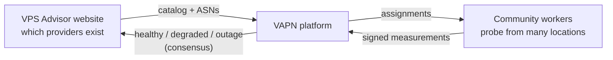

# VAPN Documentation

**VPS Advisor Probe Network** — the distributed network-observability backend
that measures the public network health of VPS providers and feeds
trust-weighted results back to the [VPS Advisor](https://vpsadvisor.example)
website.

> **New here?** Read [What is VAPN?](#what-is-vapn) below, then jump to the
> path that matches you in [Where should I start?](#where-should-i-start).

---

## What is VAPN?

VAPN answers one question at scale: **"Is this hosting provider's network
healthy right now — globally, and in my part of the world?"**

It does that without ever logging into anyone's server. Instead, a fleet of
small, community-run programs (**workers**) send lightweight network probes to
the *public* addresses that each provider announces to the Internet, from many
vantage points around the world. No single worker's opinion is trusted on its
own. The platform combines many independent measurements into a **consensus**
verdict, weights each worker by how reliable it has proven to be (**trust**),
and publishes only the agreed-upon result.

**This repository is not the VPS Advisor website.** VPS Advisor is an
independent, already-live provider-review platform. VAPN is the *measurement
machine* behind one of its features (Provider Network Health). VPS Advisor
stays the source of truth for which providers exist; VAPN never crawls the
Internet looking for them. See [Project background](#project-background).

### Why does it exist?

Traditional uptime monitors watch a *specific server* you own and control.
That tells you nothing about a provider you're *considering*. VAPN measures the
thing a prospective customer actually cares about: **the provider's own public
network** — is it reachable, is it fast, is it stable — measured
independently, from the outside, by a community rather than by the provider
itself. See [Core Concepts → Why community measurement](concepts/measurement-and-consensus.md).

### What problems does it solve?

| Problem | How VAPN addresses it |
|---|---|
| "Uptime" pages are self-reported and easy to game | Measurements come from independent community workers, not the provider |
| A single monitor is one biased vantage point | Many workers across regions and networks; results are a **consensus** |
| Any one worker could lie or be compromised | Every measurement is cryptographically signed; workers earn **trust**; liars are outvoted and quarantined |
| Global "up" hides regional problems | Verdicts are computed per region, not just globally |
| Monitoring must not become abuse | Workers only probe addresses derived from providers' own announced routes, rate-limited by policy |

---

## Who is this documentation for?

VAPN touches several very different audiences. Each has a reading path below.

| You are… | You want to… | Start here |
|---|---|---|
| **A community member** with a spare Linux box | Run a worker and contribute measurements | [Install a worker](worker/installation.md) |
| **An operator / DevOps engineer** | Deploy and run the platform itself | [Install the builder](builder/installation.md) |
| **A VPS Advisor / Django developer** | Integrate the website with VAPN | [VPS Advisor Integration](integration/README.md) |
| **A contributor / developer** | Understand the code and submit changes | [Development](development/README.md) |
| **Someone who wants to understand it deeply** | Learn the whole system from first principles | [The Project Handbook](handbook/README.md) |

No networking background is assumed anywhere. Every networking term —
**IP address, CIDR, ASN, BGP, RIPE, RIS, MRT, GeoIP** — is explained from
scratch in [Core Concepts](concepts/README.md) as if you are an experienced
software developer who has simply never worked with Internet routing.

---

## Where should I start?

### 🧭 Contributors (run a worker)
1. **[Install a worker](worker/installation.md)** — running in about five minutes
2. [What a worker does & what it costs you](worker/resources-and-privacy.md)
3. [Operating a worker](worker/operations.md) — every command, updating, leaving
4. [Troubleshooting & FAQ](worker/troubleshooting.md)

### 🛠️ Operators (run the platform)
1. **[Install the builder](builder/installation.md)** — fresh VPS to a published
   signed snapshot, step by step. This brings up the whole platform
2. [How the builder works](builder/README.md) — how the routing data is made
3. [Deployment reference](operations/deployment.md) — the topology, profiles, scaling
4. [Operations](operations/README.md) — monitoring, backups, upgrades, incident response

### 🌐 VPS Advisor / Django developers
1. [Integration overview](integration/README.md)
2. [Django integration guide](integration/django-integration.md) — models, endpoints, tasks, admin
3. [API Reference → VPS Advisor endpoints](api/README.md#a-vps-advisor-endpoints)

### 💻 Developers & the curious
1. [Core Concepts](concepts/README.md) — the networking foundations
2. [End-to-end walkthrough](walkthroughs/end-to-end.md) — follow one measurement from provider to public verdict
3. [Development guide](development/README.md) — build, test, and contribute
4. [The Project Handbook](handbook/README.md) — the whole story, cover to cover

---

## Documentation map

| Section | What's inside |
|---|---|
| [Core Concepts](concepts/README.md) | The Internet, IP/CIDR, ASN, BGP, RIPE/RIS/MRT, GeoIP, consensus & trust |
| [Architecture](architecture/README.md) | System design, domain model, database, security & trust, lifecycles, deployment, risk, roadmap |
| [Walkthroughs](walkthroughs/README.md) | End-to-end trace plus focused deep dives (authentication, measurement, trust) |
| [Routing Builder](builder/README.md) | How routing intelligence is built from RIPE RIS data — and the step-by-step install |
| [Community Workers](worker/README.md) | Everything about running a worker: install, commands, lifecycle, cost, privacy |
| [VPS Advisor Integration](integration/README.md) | The complete contract for the Django website team |
| [API Reference](api/README.md) | Every endpoint: purpose, auth, request, response, errors, examples |
| [Operations](operations/README.md) | Deploy, monitor, back up, upgrade, recover, respond to incidents |
| [Development](development/README.md) | Repo layout, standards, testing, CI, releases, contribution guide |
| [Reference](reference/README.md) | CLI, configuration, environment variables, database schema, glossary |
| [Project Handbook](handbook/README.md) | The entire system as one book, from networking fundamentals up |
| [Demos](demos/) | A runnable walkthrough of each build phase |
| [Changelog](../CHANGELOG.md) | What changed in each release, and what it means for compatibility |

Where a fact appears in more than one place, one document is **authoritative**
and the others link to it:

| Topic | Authoritative source |
|---|---|
| Every setting, default, and accepted value | [Configuration reference](reference/configuration.md) |
| Every HTTP endpoint and schema | [API reference](api/README.md) |
| Components, data flows, design decisions | [Architecture](architecture/README.md) |
| Every command | [CLI reference](reference/cli.md) |
| Every term | [Glossary](reference/glossary.md) |
| What changed between releases | [Changelog](../CHANGELOG.md) |

---

## Project background

VPS Advisor is an independent cloud/VPS provider review platform: providers
claim listings, publish products, and receive reviews. One planned feature is
**Provider Network Health** — and VAPN is the backend that powers it.

Two systems, one clean boundary:

- **VPS Advisor (the website)** owns identity, the provider catalog, ASN
  ownership, worker enrollment, the admin dashboard, and presentation. It
  already exists and is in production.
- **VAPN (this repository)** owns routing intelligence, probe scheduling,
  measurement execution, consensus, trust, and aggregation. It publishes
  results *back* to VPS Advisor.

The full brief lives in [`CLAUDE.md`](../CLAUDE.md) at the repository root.
The design that flowed from it is in [Architecture](architecture/README.md).

## Status

All eleven build phases are complete. Per-phase runnable walkthroughs are in
[`docs/demos/`](demos/); the design record is in
[`docs/architecture/`](architecture/). The supported v1 deployment is a single
Ubuntu VM running Docker Compose behind Caddy.

## A note on terminology

Networking is full of acronyms. Whenever this documentation uses one for the
first time in a document, it links to its definition. If you ever hit a term
you don't recognize, the [Glossary](reference/glossary.md) defines every one in
plain language.
