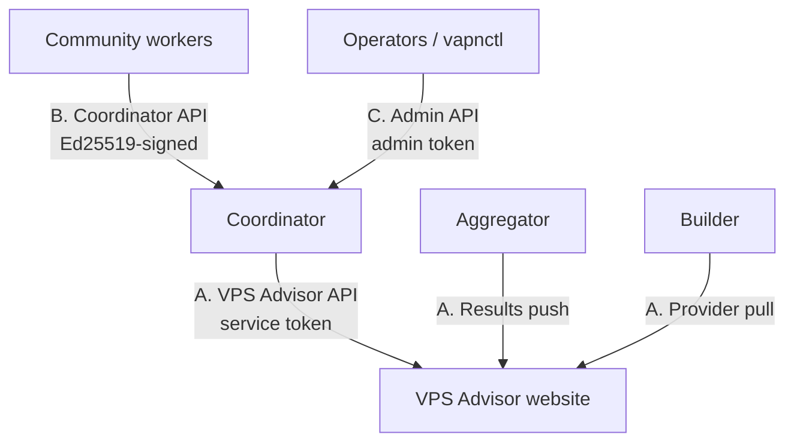

# API Reference

Every endpoint in the system, grouped by the three API surfaces, each with
purpose, authentication, request, response, status codes, and examples. This is
the canonical schema reference; the design rationale for *why* there are three
surfaces is in [architecture 04](../architecture/04-api-contracts.md), and the
Django-side implementation guide is [here](../integration/django-integration.md).

## The three surfaces



| Surface | Who calls it | Who implements it | Auth |
|---|---|---|---|
| **[A. VPS Advisor endpoints](#a-vps-advisor-endpoints)** | the platform (builder/coordinator/aggregator) | the **website team** | service token (bearer/HMAC/mTLS) |
| **[B. Coordinator API](#b-coordinator-api)** | community workers | this platform | Ed25519 request signing |
| **[C. Platform admin API](#c-platform-admin-api)** | operators / `vapnctl` | this platform | admin token, network-restricted |

## Conventions (all surfaces)

- **Transport:** JSON over HTTPS; `Content-Type: application/json`.
- **Errors:** RFC 7807 `application/problem+json`:
  ```json
  { "type": "about:blank", "title": "invalid signature",
    "status": 401, "detail": "signature verification failed" }
  ```
- **Pagination:** cursor-based — `?cursor=&limit=`; responses carry
  `next_cursor` (follow it while non-null).
- **Idempotency:** mutating platform→website calls carry an `Idempotency-Key`;
  worker uploads are idempotent by batch id.
- **Versioning:** base path `/api/v1/`.
- **Timestamps:** RFC 3339 / ISO 8601, UTC.

---

## A. VPS Advisor endpoints

Implemented by the website team; consumed by the platform (server-to-server) or
humans. Full Django guide: [integration](../integration/django-integration.md).
Auth: platform service credential (`Authorization: Bearer <token>`), scoped to
`/api/v1/monitoring/*`; human pages use website session auth + new permissions.

### A1. Provider catalog (platform pulls)

| Method & path | Purpose |
|---|---|
| `GET /api/v1/monitoring/providers` | List monitorable providers. Filters `?enabled=true`, `?updated_since=`. |
| `GET /api/v1/monitoring/providers/{id}` | Single provider; `404` if unknown. |
| `GET /api/v1/monitoring/asns` | Flat ASN→provider map for cheap delta sync. |

**Request:** `GET /api/v1/monitoring/providers?enabled=true`
**Response 200:**
```json
{ "providers": [ { "provider_id": "7f9c...", "name": "ExampleHost",
    "asns": [64500, 64501], "monitoring_enabled": true, "priority": 10,
    "updated_at": "2026-07-18T06:00:00Z" } ], "next_cursor": null }
```
**Status:** `200` ok · `401` bad token.

### A2. Enrollment (operator UI + platform pull)

| Method & path | Auth | Purpose |
|---|---|---|
| `POST /api/v1/monitoring/workers` | operator session | Create worker; returns one-time token. |
| `POST /api/v1/monitoring/workers/{id}/regenerate-token` | operator session | Replace unused/expired token. |
| `GET /api/v1/monitoring/workers` | operator session | Operator's own workers + state. |
| `GET /api/v1/monitoring/enrollments/pending` | service token | Pending enrollments + token hashes. |
| `POST /api/v1/monitoring/enrollments/{id}/registered` | service token | Ack registration; `204`, idempotent. |

**`GET …/enrollments/pending` → 200:**
```json
{ "enrollments": [ { "enrollment_id": "en-123", "worker_id": "9f30...",
    "worker_name": "helsinki-1", "operator_id": "user-uuid",
    "token_hash": "hex sha256", "expires_at": "2026-07-19T08:00:00Z" } ],
  "next_cursor": null }
```

### A3. Admin decisions (admin UI + platform pull)

| Method & path | Purpose |
|---|---|
| `GET /api/v1/monitoring/admin/decisions?since=` | Platform syncs approve/suspend/quarantine/retire decisions (oldest first). |

**Response 200:**
```json
{ "decisions": [ { "decision_id": "d-1", "worker_id": "9f30...",
    "state": "active", "reason": "verified operator",
    "decided_at": "2026-07-18T09:00:00Z" } ], "next_cursor": null }
```

### A4. Results ingestion (platform pushes — idempotent)

| Method & path | Purpose |
|---|---|
| `PUT /api/v1/monitoring/results/providers/{id}` | Upsert current status document. |
| `POST /api/v1/monitoring/results/anomalies` | Open/update/resolve anomaly events. |
| `POST /api/v1/monitoring/results/history` | Periodic rollup batches for charts. |
| `POST /api/v1/monitoring/telemetry/fleet` | Fleet summary for the admin dashboard. |

**`PUT …/results/providers/{id}` body:**
```json
{ "as_of": "2026-07-18T08:05:00Z",
  "global": { "verdict": "healthy", "confidence": 0.97,
    "metrics": { "rtt_p50_ms": 21.4, "rtt_p95_ms": 38.2, "loss_rate": 0.001,
                 "worker_count": 14, "dissent_ratio": 0.02 } },
  "regions": [ { "region": "eu-west", "verdict": "healthy", "confidence": 0.99 },
               { "region": "ap-south", "verdict": "insufficient_data", "confidence": 0 } ] }
```
**Verdicts:** `healthy | degraded | outage | insufficient_data`.
**Status:** `2xx` (fast ack; `202` fine). Non-2xx → platform retries with
backoff. **Render `insufficient_data` as "not enough data," never an outage.**

---

## B. Coordinator API

The high-volume, machine-facing surface workers talk to. **Auth:** Ed25519
request signing on every call except `register` — headers `X-Worker-Id`,
`X-Timestamp`, `X-Nonce`, `X-Signature` over
`method | path | timestamp | nonce | sha256(body)`. Full mechanics:
[worker authentication](../walkthroughs/worker-authentication.md).

| Method & path | Purpose |
|---|---|
| `POST /api/v1/workers/register` | One-time: enrollment token + public key + facts → `worker_id`, state `pending`. |
| `POST /api/v1/workers/heartbeat` | Liveness + version + stats → config, lease renewals, snapshot version, control actions. |
| `GET /api/v1/artifacts/routing/current` | Current snapshot manifest (version, url, sha256, signature, min_worker_version). |
| `POST /api/v1/assignments/lease` | Request work → assignment batch with lease expiry. |
| `POST /api/v1/assignments/release` | Voluntarily return assignments (shutdown/drain). |
| `POST /api/v1/observations` | Upload signed observation batch (idempotent by batch id). |
| `POST /api/v1/workers/keys/rotate` | Submit next public key signed by current; returns overlap window. |
| `GET /api/v1/workers/me` | Own state/trust snapshot (operator transparency). |

**`POST /api/v1/workers/register` body:**
```json
{ "enrollment_token": "…", "public_key": "base64 ed25519",
  "software_version": "1.2.0", "reported_country": "FI" }
```
**→ 201:** `{ "worker_id": "9f30...", "state": "pending" }`

**`POST /api/v1/workers/heartbeat` → 200 (abridged):**
```json
{ "state": "active",
  "snapshot": { "version": "20260718T0800Z-1723118400000" },
  "leases": [ { "assignment_id": 812, "expires_at": "..." } ],
  "control": [ ],
  "config": { "heartbeat_seconds": 30, "upload_seconds": 60 } }
```
Control actions include `rotate_key`, `drain`, `suspend`, `upgrade_required`.

**`POST /api/v1/observations` body (abridged):**
```json
{ "batch_id": "0197a3...", "observations": [ {
    "assignment_id": 812, "target": "203.0.113.7", "probe_type": "icmp",
    "measured_at": "2026-07-18T08:04:31.201Z", "ok": true,
    "rtt_ms": 22.9, "packets_sent": 4, "packets_lost": 0,
    "signature": "base64…" } ] }
```
**→ 200** with per-item accept/reject (207-style).

**Status codes:** `401` invalid signature / expired timestamp · `403` wrong
state (e.g. suspended) · `409` replayed nonce / duplicate batch · `422`
malformed observation · `429` policy rate-limit.

---

## C. Platform admin API

Operator/automation surface on the coordinator, authenticated by an **admin
token** (`Authorization: Bearer <VAPN_ADMIN_TOKEN>`) and network-restricted
(bind to an internal interface / allowlist CIDR via `VAPN_ADMIN_ALLOW_CIDR`).
This is what [`vapnctl`](../reference/cli.md#vapnctl-platform-administration) drives — the operational
escape hatch mirroring what the VPS Advisor admin dashboard does via the A3
sync.

| Area | Capability |
|---|---|
| Fleet | status overview; worker list; worker detail (state, trust, leases, events) |
| Worker lifecycle | create (returns one-time token); approve / suspend / quarantine / retire (with reason); force key rotation |
| Snapshots | list versions; rollback to a previous published version |
| Scheduler | pause / resume (global assignment kill switch) |
| Audit | query the append-only audit log (`?category=&since=&limit=`) |

These map 1:1 to `vapnctl` subcommands — see the
[CLI reference](../reference/cli.md#vapnctl-platform-administration). Because it's the direct control
plane, keep it off the public Internet; the website's admin dashboard (surface
A) is the primary human UI and this is the automation/escape-hatch layer.

## Error catalog (quick reference)

| Status | Meaning | Surfaces |
|---|---|---|
| `400` | Malformed request | all |
| `401` | Missing/invalid credential or signature | all |
| `403` | Authenticated but not allowed (wrong worker state, missing permission) | B, C, A(human) |
| `404` | Unknown resource | A, C |
| `409` | Conflict — replayed nonce, duplicate batch, idempotency clash | B, A(push) |
| `422` | Semantically invalid (bad observation) | B |
| `429` | Rate-limited by policy | B |
| `5xx` | Server error — callers retry with backoff | all |

All error bodies are RFC 7807 problem+json.
