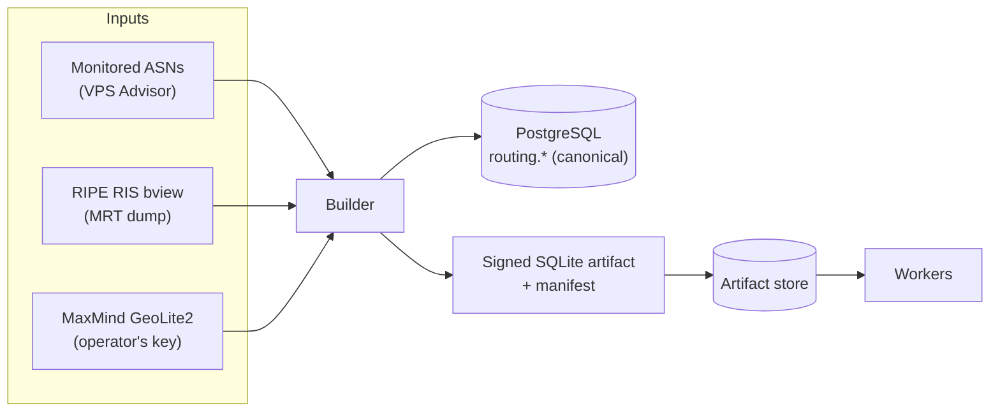
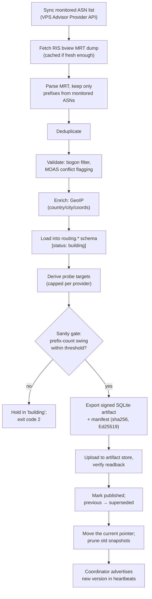

# How the Builder Works

The **builder** turns raw global routing data into a trustworthy, signed list of
addresses for workers to probe. It is the only part of VAPN that ever reads
RIPE data or MaxMind databases. This page explains it from first principles —
what the inputs are, what it does with them, and why.

> **Just want one running?** → [Install the builder](installation.md). You do
> not need this page first.

> **New to routing?** Read [Core Concepts](../concepts/README.md) — especially
> [RIPE/RIS/MRT](../concepts/ripe-and-ris.md) and
> [prefix ownership](../concepts/prefix-ownership.md). This page assumes those.

## What problem the builder solves

Workers need to know *exactly which addresses belong to each monitored
provider*, and they need to trust that list absolutely — a wrong entry means
probing someone else's network. But computing that list is expensive and
security-sensitive: it means downloading a multi-gigabyte global routing dump,
parsing a binary format, filtering, deduplicating, validating, and geolocating.

The builder does all of that **once, centrally, and auditably**, then publishes
a tiny **signed** artifact. Thousands of workers consume the finished artifact;
none of them ever touches the raw data. This single boundary is the reason
workers can be a few MB of RAM and the routing logic can be improved without
redeploying the fleet.

The builder is a **batch job, not a daemon** — it runs, publishes, and exits.
It has no inbound network surface and its cost is independent of how many
workers exist.

## The inputs, explained

### 1. The monitored ASN list (from VPS Advisor)

The builder asks VPS Advisor which providers/ASNs to monitor. This is the
*membership* input — it decides which slice of the global table to keep. VAPN
never scans the Internet; it only ever extracts prefixes for these ASNs.

If VPS Advisor reports the same ASN under two providers, the build **fails**
rather than guessing which one owns it.

### 2. The RIPE RIS `bview` dump (MRT)

This is the routing input: a full snapshot of the global routing table.

- **What RIPE is:** a [Regional Internet Registry](../concepts/ripe-and-ris.md#ripe-ncc-one-of-the-internets-registries)
  that, among other things, runs a free public recording of global routing.
- **What RIS is:** the [Routing Information Service](../concepts/ripe-and-ris.md#ris-the-routing-information-service) —
  collectors that passively record BGP announcements from many real networks.
- **What a `bview`/RIB dump is:** a periodic (every 8 h) full-table snapshot —
  "here is every route the collector currently sees."
- **What MRT is:** the binary file format (RFC 6396) the dump is stored in.
  Compact, standard, complete — and the reason a dedicated parser
  (`internal/routing/mrtreader`) exists.
- **Why MRT and not a live BGP feed:** VAPN wants *membership* ("which prefixes
  do these ASNs announce right now"), which a full-table snapshot answers
  directly, plus *churn* (from diffing snapshots) — neither needs the raw
  second-by-second update stream, and a snapshot is far simpler and safer to
  process.

The dump is cached locally between runs. A build re-downloads it only when the
local copy is older than `VAPN_RIS_BVIEW_MAX_AGE` (default 6 h) — so the
8-hourly schedule always fetches fresh data, while a manual re-run minutes later
reuses what is already on disk. Downloads go to a temporary file and are only
moved into place on success, so a killed build never leaves a truncated dump
behind.

### 3. MaxMind GeoLite2 (the operator's own key)

The [GeoIP](../concepts/geoip.md) input — used to attach country/city/coords to
each prefix so verdicts can be regional. Each operator supplies their own
MaxMind licence key; the databases are never redistributed by the project, and
GeoIP refresh runs on an independent cadence.

Enrichment is skipped with a warning if `VAPN_GEOIP_CITY_MMDB` is unset. If it
*is* set but the file is missing, the build fails — a configured input that
cannot be read is an error, not a silent downgrade.

## One build, stage by stage

Each numbered stage maps to real code in `internal/builder` and
`internal/artifact`.

1. **Sync monitored ASNs** from VPS Advisor into `routing.provider` /
   `routing.asn`. Providers that disappeared upstream are soft-delisted.

2. **Fetch the RIS `bview`** — downloaded from `VAPN_RIS_BVIEW_URL`, or read
   from `VAPN_RIS_BVIEW_PATH` if the operator supplies the file out of band (as
   the development stack does).

3. **Parse + origin-filter**: stream the MRT and keep only prefixes originated
   by a monitored ASN. This is the big reduction — roughly a million routes down
   to a few thousand.

4. **Deduplicate**: collapse the many per-peer reports of a
   `(prefix, origin AS)` into one fact, keeping the highest peer-visibility
   count seen. → [why duplicates exist](../concepts/prefix-ownership.md#complication-1-duplicate-prefixes)

5. **Validate**:
   - **Bogon filter** (`internal/routing/bogon`) — drop private/reserved
     prefixes that must never be probed.
   - **MOAS flagging** — a prefix announced by several origins is *flagged*
     (`moas`, plus the other origins) rather than resolved by guessing.
   - **Over-long prefixes** are flagged `long_prefix` and excluded from target
     derivation.

6. **Enrich with GeoIP** (`internal/routing/geo`) — country, city, coordinates,
   looked up per prefix.

7. **Load into `routing.*`** under a new `routing.snapshot` row with status
   `building`. Prefixes are per-snapshot and immutable, so diffing consecutive
   snapshots yields routing-churn signals.

8. **Derive probe targets** — for each prefix, the **first usable address**
   (network address + 1), with the reason recorded alongside it. Overlapping
   announcements that resolve to the same address are collapsed, preferring the
   least-specific covering prefix. The result is capped at
   `VAPN_MAX_TARGETS_PER_PROVIDER` (default 100) **per provider per address
   family**, ranked by prefix size and how widely the prefix is seen.

9. **Sanity gate** — compare the total prefix count against the currently
   published snapshot. A swing larger than `VAPN_SANITY_MAX_DELTA_PCT`
   (default 50%) leaves the snapshot in `building` and exits with **code 2**;
   the previous snapshot stays published. `VAPN_SANITY_FORCE=true` overrides it
   for one run. The very first build has nothing to compare against and always
   passes.

10. **Export + sign** — write the worker-facing subset to a compact **SQLite**
    file and produce a **manifest** carrying the version, object key, sha256,
    size, prefix/target counts, `min_worker_version`, and an **Ed25519
    signature** over all of it.

11. **Publish atomically** — upload the artifact and the manifest, then **read
    both back and verify** the signature and hash before anything is marked
    published. Then, in one transaction, the new snapshot becomes `published`
    and the previous one `superseded`.

12. **Point and prune** — move the `current` pointer object to the new version,
    then delete routing rows and store objects for superseded snapshots beyond
    the newest `VAPN_RETAIN_SNAPSHOTS` (default 5). The published snapshot is
    never pruned.

If any stage fails, the build stops and the previously published snapshot stays
fully in force. Workers never see a half-built snapshot.

## Exit codes

The builder is designed to be run by a scheduler, so its exit code is the
contract:

| Code | Meaning |
|---|---|
| **0** | A snapshot was built, signed, and published |
| **2** | The sanity gate held the snapshot for review — alertable, not a crash |
| **1** | The build failed; the log names the failing stage |

## Snapshot versioning, validation, and rollback

- **Versioning:** each snapshot's version combines the routing data's own
  timestamp with the build time, e.g. `20260808T0800Z-1723118400000`. It is
  monotonic, and workers refuse to move to an older version than the one they
  already hold.
- **Validation, two layers:** the *build-time* sanity gate guards against
  poisoned input; the *consume-time* signature and sha256 check on every worker
  guards against a tampered or corrupt artifact. The artifact store is
  untrusted by design.
- **Rollback:** `vapnctl snapshots rollback <version>` re-publishes a previous
  snapshot and re-points `current` at it — an audited action. Because
  publication is atomic, rollback is instantaneous from the workers' view. It
  refuses versions whose routing data has already been pruned.

## What workers actually receive

The published SQLite file contains only the worker-facing subset:

| Table | Columns | Worker uses it to… |
|---|---|---|
| `prefixes` | `prefix, origin_asn, provider_id, geo_country` | validate that a target is legitimate |
| `targets` | `address, provider_id, prefix` | know the probeable addresses |
| `meta` | `version, min_worker_version` | check compatibility and freshness |

Workers use it for **local validation and enrichment** — never to *choose*
targets. Assignments come from the coordinator's scheduler. Download and
verification are covered in the
[worker authentication walkthrough](../walkthroughs/worker-authentication.md).

## Cadence

Snapshots build **three times a day** — 00:30, 08:30 and 16:30 UTC with up to
10 minutes of jitter — half an hour behind RIS's own 8-hourly `bview`
publication. GeoIP refresh is an **independent** job on a 72-hour cycle; a
GeoIP update never triggers a routing rebuild and vice versa. Full detail:
[snapshot lifecycle](../architecture/06-lifecycles.md#2-snapshot-lifecycle).

Provider address ranges change slowly, so a missed build costs freshness, not
availability.

## Failure, recovery, and scalability

| Concern | Behavior |
|---|---|
| **RIS download fails** | Build aborts; previous published snapshot stays fully in force |
| **Any build step fails** | Nothing is published; atomic publish means workers never see a partial build |
| **Poisoned routing data (leak/hijack)** | Sanity gate holds anomalous builds for a human; bogon/MOAS validation drops or flags bad prefixes |
| **Bad snapshot published** | `vapnctl snapshots rollback` re-points to a good version (audited) |
| **Artifact store compromised** | Store is untrusted; signature verification on every worker catches tampering |
| **Fleet growth** | Artifact distribution is CDN-offloadable from day one; the builder's cost is independent of worker count |

## Why it's designed this way

- **One place parses MRT.** Expensive, security-sensitive parsing happens once,
  centrally, auditably — never on thousands of workers.
- **Atomic publish, failed-stays-safe.** Workers always run on a complete,
  verified snapshot; a broken build is a no-op, not an outage.
- **Signed artifacts over an untrusted store.** The signature is the integrity
  guarantee, so the store can sit behind any CDN without being trusted.
- **Sanity gate plus rollback.** Bad routing data can't silently redirect the
  fleet; a human is in the loop for anomalous builds, and rollback re-points to
  a known-good snapshot.
- **Never guess.** MOAS conflicts are flagged, duplicate ASN claims are hard
  errors. Ambiguity is surfaced, not resolved.

## Future extensions

- Additional RIS collectors / cross-collector agreement for stronger ownership
  signals.
- RPKI validation (is this origin cryptographically authorized for this
  prefix?) layered onto the existing MOAS/bogon validation.
- Richer target selection (per-region representative sampling) behind the same
  `targets` table shape — no worker or schema change needed.

---

**Next:** [Install the builder](installation.md) ·
[Configuration reference](../reference/configuration.md#builder) ·
[Design record: architecture 01 §4.1](../architecture/01-system-architecture.md#41-snapshot-builder-builder)
