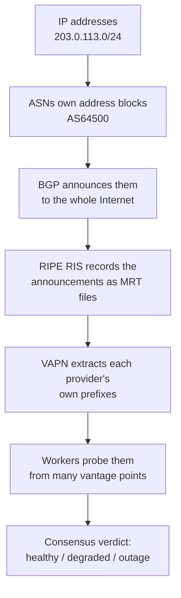

# Core Concepts

VAPN sits on top of how the Internet actually routes traffic — a topic most
software developers never need to touch. This section teaches the foundations
**from first principles**, assuming you're a capable programmer who has simply
never worked with Internet routing. No prior knowledge of IP, CIDR, ASN, BGP,
or RIPE is assumed.

Read these in order the first time; each builds on the last. If you only have
ten minutes, read [The Internet in one page](#the-internet-in-one-page) below
and then jump to whichever concept a guide sent you here for.

## Learning path

| # | Concept | You'll understand |
|---|---|---|
| 1 | [How the Internet works](how-the-internet-works.md) | IP addresses, subnets, **CIDR**, how a packet finds its way |
| 2 | [ASN & BGP](asn-and-bgp.md) | **Autonomous Systems**, **BGP**, how networks announce and reach each other |
| 3 | [RIPE, RIS & MRT](ripe-and-ris.md) | Who records global routing, and the **MRT** files that capture it |
| 4 | [Prefix ownership](prefix-ownership.md) | How VAPN decides which addresses belong to a provider |
| 5 | [GeoIP](geoip.md) | Turning IP addresses into countries and regions |
| 6 | [Measurement, consensus & trust](measurement-and-consensus.md) | Why one measurement isn't enough, and how VAPN builds public truth |

## The Internet in one page

Before the details, here's the whole chain VAPN depends on, in plain terms:

1. **Everything online has an IP address** — a numeric label like a postal
   address. Addresses come in blocks, written in **CIDR** notation like
   `203.0.113.0/24` (256 addresses). → [1](how-the-internet-works.md)

2. **The Internet is a network of networks.** Each big network — an ISP, a
   cloud provider, a university — is an **Autonomous System** with a number,
   its **ASN** (e.g. AS64500). A hosting provider owns one or more ASNs.
   → [2](asn-and-bgp.md)

3. **Networks tell each other which addresses they own** using a protocol
   called **BGP**. "AS64500 announces `203.0.113.0/24`" means: to reach any
   address in that block, send traffic toward AS64500. → [2](asn-and-bgp.md)

4. **These announcements are recorded.** **RIPE** (a regional Internet
   registry) runs **RIS**, a system of collectors that continuously capture
   global BGP announcements into files in the **MRT** format.
   → [3](ripe-and-ris.md)

5. **VAPN reads those recordings** to learn, for each provider it monitors,
   exactly which address blocks that provider announces to the world — its
   *public network*. → [4](prefix-ownership.md)

6. **Workers then probe representative addresses** from those blocks, from many
   places, and VAPN combines the results into a trusted verdict.
   → [6](measurement-and-consensus.md)

Everything VAPN does is a careful, trustworthy pipeline over those six ideas.
Start with [How the Internet works](how-the-internet-works.md).
