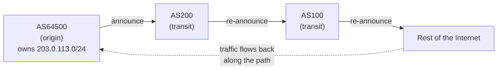

# ASN & BGP: The Internet's Network of Networks

**Problem this solves:** VAPN monitors *providers*, and a provider's identity on
the Internet is its **ASN**(s). To know which addresses belong to a provider —
and therefore which addresses to probe — you have to understand what an ASN is
and how networks announce their addresses using **BGP**. This page explains
both from scratch.

Read [How the Internet works](how-the-internet-works.md) first if you haven't;
this page assumes you know what an IP prefix is.

## The Internet is a network of networks

"The Internet" isn't one network. It's tens of thousands of independent
networks that agree to interconnect. Each independent network — a big ISP, a
cloud provider, a university, a hosting company — is called an **Autonomous
System (AS)**.

"Autonomous" is the key word: each AS is run by one organization that makes its
own routing decisions internally. From the outside, an AS is a black box that
says "here are the address blocks you can reach through me."

Every AS has a globally unique number, its **Autonomous System Number (ASN)**,
written like `AS64500`. ASNs are handed out by the same regional registries
that hand out address blocks (RIPE, ARIN, APNIC, …). A hosting provider you'd
find on VPS Advisor typically owns **one or a few ASNs**.

> **Analogy:** if IP prefixes are streets, an **AS is a courier company** with
> a company number (its ASN). Each courier controls delivery within its own
> territory and hands packages off to other couriers at the borders. "The
> postal system" is all these couriers cooperating.

This is why VAPN's source of truth is *ASNs*: a provider *is*, on the Internet,
its set of ASNs and the address blocks those ASNs announce.

## BGP: how networks tell each other what they can reach

Given thousands of autonomous networks, how does traffic get from any one to any
other? They have to exchange reachability information: "I can deliver to these
blocks; here's the path." The protocol they use is the **Border Gateway
Protocol (BGP)** — the routing protocol *between* Autonomous Systems. BGP is,
quite literally, what glues the Internet together.

Here's the essential mechanic. An AS **announces** (or "advertises") the
prefixes it can deliver to, along with the **AS path** — the sequence of ASes a
packet would traverse to get there.

```
AS64500 announces:  203.0.113.0/24   AS path: [64500]
```

That means: "I, AS64500, originate `203.0.113.0/24` — to reach it, come to me."
AS64500 is the **origin AS** for that prefix.

Its neighbors re-announce it, prepending themselves to the path:

```
AS64500 → AS200 → AS100
AS100 now knows:  203.0.113.0/24   AS path: [100, 200, 64500]
```

Read the path right-to-left as "…via AS200, which originated at AS64500." Every
router that hears this announcement learns: *to reach `203.0.113.0/24`, forward
toward the neighbor that told me, and the traffic will end up at AS64500.*



> **Analogy:** each courier company shouts to its neighbors, "I can deliver to
> Maple Street!" Neighbors relay the shout, adding "…and you get there through
> me." Eventually every hub knows a direction that leads to Maple Street, even
> though none of them has a global map. Routing is **rumor that converges.**

### Route propagation and why it's not instant

When AS64500 first announces a prefix, the announcement **propagates** outward
hop by hop. It takes seconds to a few minutes for the whole Internet to hear it.
The same is true when a route is *withdrawn* (an AS says "I can no longer reach
this block") — that news propagates too.

This propagation is where **routing health** shows up:

- If a provider's routes are **withdrawn** unexpectedly (a misconfiguration, an
  upstream failure), parts of the Internet lose the path to it — an **outage**,
  even if the provider's servers are fine.
- If routes keep **flapping** (announced, withdrawn, re-announced), the network
  is unstable — routing churn that hurts reachability intermittently.

VAPN doesn't speak BGP itself. Instead it reads *recordings* of these
announcements (via [RIPE RIS](ripe-and-ris.md)) to learn each provider's
current prefixes, and detects instability by comparing successive recordings
plus what workers actually observe.

## The origin AS: who *owns* a prefix

For VAPN, one field matters most: the **origin AS** — the AS at the end of the
path, the one that actually originates the announcement. If AS64500 is a
provider VAPN monitors, then every prefix whose origin is AS64500 is part of
that provider's public network and is fair game to probe.

This sounds clean, and usually is, but the real world adds wrinkles:

- **A prefix can be announced by more than one origin AS** at once — called a
  **MOAS** (Multiple Origin AS). Sometimes legitimate (a company using two of
  its own ASNs), sometimes a sign of a hijack or leak.
- **Bogus announcements** exist — private or reserved address blocks
  ("bogons") that should never appear in global routing, or absurd prefix
  lengths.

VAPN's builder filters these carefully so it never probes something a provider
doesn't actually own. That filtering is the subject of
[Prefix ownership](prefix-ownership.md).

## Why this matters to VAPN, concretely

Put it together and you get VAPN's core data question, now fully grounded:

> "For provider *P*, which owns ASNs *{A₁, A₂, …}*, what is the complete set of
> address prefixes currently originated by those ASNs on the global Internet?"

Answer that accurately and you know exactly what *P*'s public network is — the
set of streets to send probes down. Answer it *wrong* (include someone else's
prefix, or miss one) and your measurements are meaningless or unfair. Getting
this right, safely, is why VAPN has a dedicated
[Routing Builder](../builder/README.md).

## Key terms from this page

| Term | Meaning |
|---|---|
| **Autonomous System (AS)** | An independently run network (ISP, cloud, host) |
| **ASN** | The globally unique number identifying an AS (`AS64500`) |
| **BGP** | The protocol ASes use to announce which prefixes they can reach |
| **Announce / withdraw** | Advertise a prefix, or retract it |
| **AS path** | The sequence of ASes a route traversed |
| **Origin AS** | The AS that originates a prefix — its owner, for VAPN's purposes |
| **MOAS** | Multiple Origin AS — a prefix announced by more than one origin |
| **Route propagation** | How announcements/withdrawals spread across the Internet over seconds-to-minutes |

Next: [RIPE, RIS & MRT](ripe-and-ris.md) — where these announcements get
recorded, and the file format VAPN reads them from.
