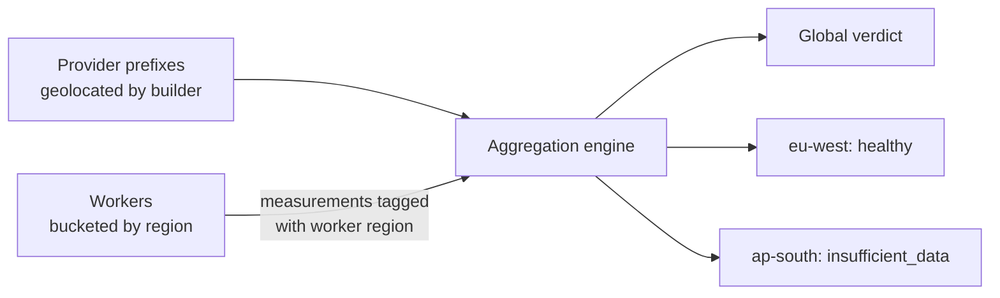

# GeoIP: Turning Addresses into Places

**Problem this solves:** VAPN answers not just "is this provider healthy?" but
"is it healthy *in my region*?" To do that it must attach geography to two
things: the provider's prefixes, and the workers doing the measuring. That
mapping — IP address → place — is **GeoIP**, and VAPN uses MaxMind's GeoLite2
databases for it.

## What GeoIP is

An IP address is just a number; it doesn't inherently encode a location.
**GeoIP** is the practice of looking an address up in a database that maps
address ranges to approximate locations (country, region, city, coordinates) and
to the registered network (ASN). Companies like **MaxMind** compile these
databases from registry data, network measurements, and other signals.

VAPN uses two MaxMind GeoLite2 databases:

| Database | Maps an IP to | Used by |
|---|---|---|
| **GeoLite2-City** | Country, city, latitude/longitude | The **builder**, to enrich prefixes |
| **GeoLite2-ASN** | The registered ASN/organization | The **coordinator**, to verify a worker's source network |

The databases are distributed as **`.mmdb`** files (MaxMind DB format) — a
compact, memory-mappable binary optimized for fast range lookups. VAPN reads
them with a standard Go MaxMind library (`internal/routing/geo`).

> **Accuracy caveat, stated up front:** GeoIP is *approximate*. Country-level
> data is usually reliable; city-level is a best-guess. VAPN treats geography as
> a **bucketing hint** for regional verdicts and worker diversity — never as
> ground truth about exactly where a server sits. Design choices lean on this:
> a region with thin or uncertain data yields `insufficient_data`, not a false
> verdict.

## How VAPN uses it

### Enriching prefixes (builder)

When the [builder](../builder/README.md) extracts a provider's prefixes from
[RIS data](ripe-and-ris.md), it looks each one up in GeoLite2-City and attaches
`geo_country`, `geo_city`, and coordinates. This lets the platform reason about
*where* a provider's network lives — e.g. "this block is announced from
Frankfurt" — and later group verdicts by region.

### Verifying workers (coordinator)

When a worker talks to the coordinator, the coordinator sees the worker's public
source IP. Looking that up in GeoLite2-ASN gives two things:

1. The worker's **source ASN** — the network it probes *from*. VAPN records this
   to (a) spread each measurement across *different* source networks for
   diversity, and (b) **exclude a worker from measuring its own provider's
   network**, so a provider can't grade its own homework. See the
   [security model](../architecture/05-security-trust-model.md).
2. The worker's **verified country**, compared against what the worker
   self-reports. A mismatch is a mild trust signal.

## Regional verdicts, made concrete

Because prefixes and workers both carry geography, consensus can be computed per
region, not just globally:

A provider can be **healthy globally but degraded in one region** — exactly the
nuance a prospective customer cares about ("great provider, but how is it from
*where I am*?"). GeoIP is what makes that distinction possible.

## Licensing and the independent update cadence

MaxMind's GeoLite2 databases are free but require a **license key** and must not
be redistributed. Two consequences shape VAPN's design:

- **Each platform operator uses their own MaxMind licence key.** The project
  never ships or redistributes the databases. In production the `geoipupdate`
  container refreshes them with the operator's key; in development,
  pre-downloaded copies live under `data/geo-data/`. **Community workers need no
  MaxMind key at all** — the builder does the authoritative enrichment centrally
  and ships only derived fields inside the signed snapshot artifact, which
  carries no redistribution constraint. This is
  [risk R8](../architecture/08-risk-assessment.md), resolved that way
  deliberately.
- **GeoIP updates are independent of routing updates.** A GeoIP refresh never
  requires rebuilding a routing snapshot, and vice versa. They're separate jobs
  on separate cadences (routing every 8 h, GeoIP every 72 h). This keeps a slow or
  failed MaxMind download from blocking routing builds and keeps the two
  concerns decoupled. See the
  [snapshot lifecycle](../architecture/06-lifecycles.md#2-snapshot-lifecycle).

## Key terms from this page

| Term | Meaning |
|---|---|
| **GeoIP** | Mapping IP addresses to approximate geographic locations |
| **MaxMind / GeoLite2** | The provider and free databases VAPN uses |
| **`.mmdb`** | MaxMind's compact binary database file format |
| **GeoLite2-City / -ASN** | The two databases: location, and registered network |
| **Source ASN** | The network a worker probes *from*, derived from its IP |
| **Regional verdict** | A health verdict computed for one region, enabled by GeoIP |

Next: [Measurement, consensus & trust](measurement-and-consensus.md) — how many
independent measurements become one trustworthy public verdict.
