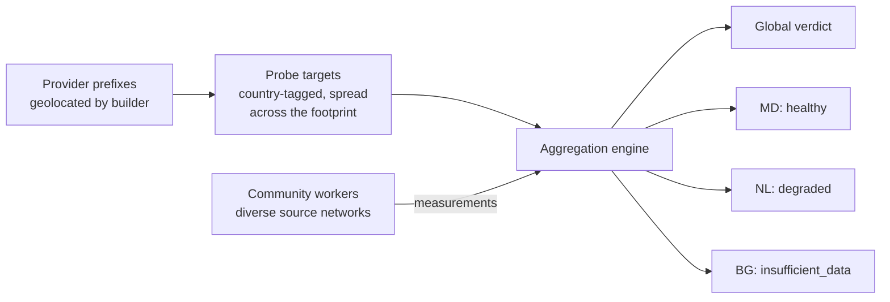

# GeoIP: Turning Addresses into Places

**Problem this solves:** VAPN answers not just "is this provider healthy?" but
"is it healthy *in my region*?" To do that it must attach geography to two
things: the provider's prefixes, and the workers doing the measuring. That
mapping — IP address → place — is **GeoIP**, and VAPN uses MaxMind's GeoLite2
databases for it.

## What GeoIP is

An IP address is just a number; it doesn't inherently encode a location.
**GeoIP** is the practice of looking an address up in a database that maps
address ranges to approximate locations (country, region, city, coordinates) and
to the registered network (ASN). Companies like **MaxMind** compile these
databases from registry data, network measurements, and other signals.

VAPN uses two MaxMind GeoLite2 databases:

| Database | Maps an IP to | Used by |
|---|---|---|
| **GeoLite2-City** | Country, city, latitude/longitude | The **builder**, to enrich prefixes |
| **GeoLite2-ASN** | The registered ASN/organization | The **coordinator**, to verify a worker's source network |

The databases are distributed as **`.mmdb`** files (MaxMind DB format) — a
compact, memory-mappable binary optimized for fast range lookups. VAPN reads
them with a standard Go MaxMind library (`internal/routing/geo`).

> **Accuracy caveat, stated up front:** GeoIP is *approximate*. Country-level
> data is usually reliable; city-level is a best-guess. VAPN treats geography as
> a **bucketing hint** for regional verdicts and worker diversity — never as
> ground truth about exactly where a server sits. Design choices lean on this:
> a region with thin or uncertain data yields `insufficient_data`, not a false
> verdict.

## How VAPN uses it

### Enriching prefixes (builder)

When the [builder](../builder/README.md) extracts a provider's prefixes from
[RIS data](ripe-and-ris.md), it does two different things with GeoLite2-City.

**1. It labels each prefix.** The prefix's first address is looked up, and the
resulting `geo_country`, `geo_city` and coordinates are stored on the prefix
row — the label shown next to a network ("this block is announced from
Frankfurt").

**2. It measures where the provider's address space actually is.** This is the
number VPS Advisor renders as "66% of this provider's IPv4 space is in
Moldova", and a first-address label is not good enough for it. Three rules make
the count honest:

- **Split at the database's own record boundaries.** A single announcement can
  span several GeoIP records in different countries. The builder walks the
  records *inside* each prefix and attributes each sub-range to the record
  covering it. It never expands a prefix into individual addresses — a `/8`
  costs no more than the number of records inside it.
- **Count address space, never prefixes.** A `/20` is sixteen `/24`s. Shares
  are `country_ipv4 ÷ total_ipv4 × 100`, computed from address counts.
- **Count each address once.** Announcements nest: a provider announcing
  `1.2.0.0/16` and `1.2.3.0/24` has announced 65 536 addresses, not 65 792.
  Every prefix is counted only for the space no more-specific announcement of
  the same provider covers — so a more-specific in a *different* country moves
  address space between countries rather than inventing it.

Address space no record places is attributed to the reserved code **`ZZ`**
(unknown) and reported as such. It is never folded into a real country, and
never quietly dropped from the total.

The result is stored per snapshot in `routing.provider_geo` (see the
[schema reference](../reference/database-schema.md#schema-routing)), and it is
also what spreads probe targets across a provider's footprint: targets are
allocated country by country, so a provider whose largest announcements are all
in one country is still measurable in the smaller ones.

### Verifying workers (coordinator)

When a worker talks to the coordinator, the coordinator sees the worker's public
source IP. Looking that up in GeoLite2-ASN gives two things:

1. The worker's **source ASN** — the network it probes *from*. VAPN records this
   to (a) spread each measurement across *different* source networks for
   diversity, and (b) **exclude a worker from measuring its own provider's
   network**, so a provider can't grade its own homework. See the
   [security model](../architecture/05-security-trust-model.md).
2. The worker's **verified country**, compared against what the worker
   self-reports. A mismatch is a mild trust signal.

## Regional verdicts, made concrete

Because every probe target carries the country of the address it represents,
consensus is computed per country as well as globally — from the same votes, in
the same pass:

A provider can be **healthy globally but degraded in one country** — exactly the
nuance a prospective customer cares about ("great provider, but how is it where
I am?"). GeoIP is what makes that distinction possible.

> **A region is the country of the address being measured, not of the worker
> measuring it.** "Is AlexHost's Dutch capacity up?" is a question about
> Dutch addresses; workers everywhere contribute to answering it, and the
> diversity of *their* networks is what makes the answer trustworthy rather
> than what defines the region.

Two things are deliberately kept apart, and the
[status document](../api/README.md#a4-results-ingestion-platform-pushes--idempotent)
reports them separately:

| | Comes from | Exists when nobody has probed? |
|---|---|---|
| **Network distribution** — where the addresses are | BGP + GeoIP | Yes |
| **Monitoring results** — how they behave | community measurements | No |

A country can hold most of a provider's address space and still have almost no
measurement coverage. That is reported as `insufficient_data` with the coverage
counts that explain it — never as an outage, and never averaged away into the
global figure.

## Licensing and the independent update cadence

MaxMind's GeoLite2 databases are free but require a **license key** and must not
be redistributed. Two consequences shape VAPN's design:

- **Each platform operator uses their own MaxMind licence key.** The project
  never ships or redistributes the databases. In production the `geoipupdate`
  container refreshes them with the operator's key; in development,
  pre-downloaded copies live under `data/geo-data/`. **Community workers need no
  MaxMind key at all** — the builder does the authoritative enrichment centrally
  and ships only derived fields inside the signed snapshot artifact, which
  carries no redistribution constraint. This is
  [risk R8](../architecture/08-risk-assessment.md), resolved that way
  deliberately.
- **GeoIP updates are independent of routing updates.** A GeoIP refresh never
  requires rebuilding a routing snapshot, and vice versa. They're separate jobs
  on separate cadences (routing every 8 h, GeoIP every 72 h). This keeps a slow or
  failed MaxMind download from blocking routing builds and keeps the two
  concerns decoupled. See the
  [snapshot lifecycle](../architecture/06-lifecycles.md#2-snapshot-lifecycle).

## Key terms from this page

| Term | Meaning |
|---|---|
| **GeoIP** | Mapping IP addresses to approximate geographic locations |
| **MaxMind / GeoLite2** | The provider and free databases VAPN uses |
| **`.mmdb`** | MaxMind's compact binary database file format |
| **GeoLite2-City / -ASN** | The two databases: location, and registered network |
| **Source ASN** | The network a worker probes *from*, derived from its IP |
| **Regional verdict** | A health verdict computed for one region, enabled by GeoIP |

Next: [Measurement, consensus & trust](measurement-and-consensus.md) — how many
independent measurements become one trustworthy public verdict.
