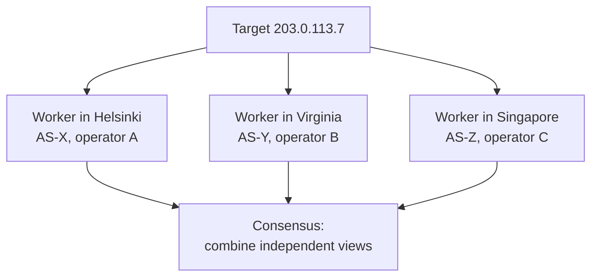
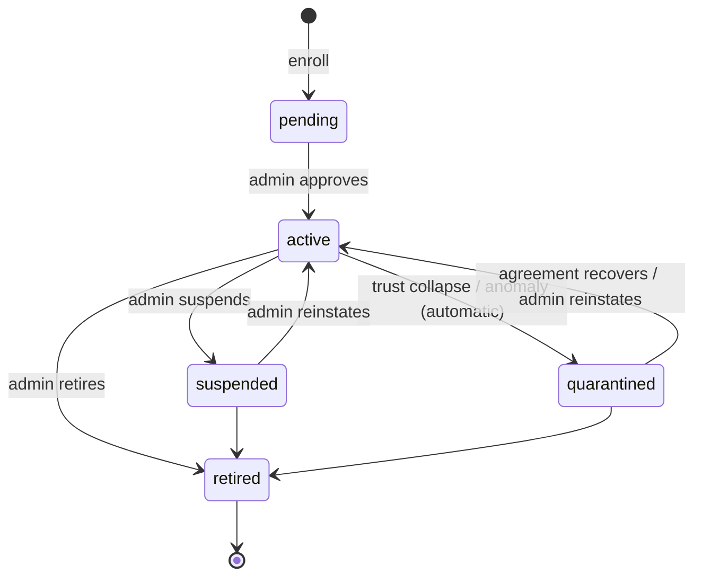
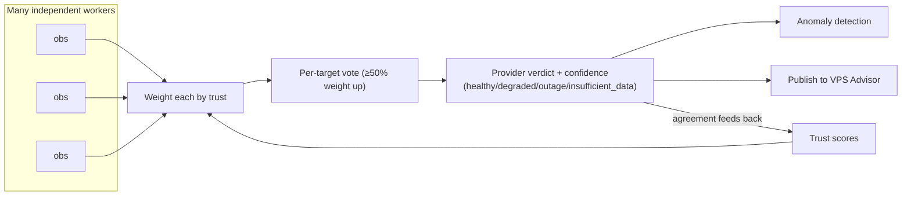

# Measurement, Consensus & Trust

**Problem this solves:** VAPN's entire output is a public verdict about a
provider's health. That verdict must be *trustworthy* even though it's built
from measurements taken by strangers on hardware VAPN doesn't control, some of
whom may be careless, misconfigured, or actively malicious. This page explains
how VAPN turns many shaky individual measurements into one verdict you can rely
on: through **redundancy**, **consensus**, and **trust**.

This is the conceptual heart of the project. The mechanics are implemented in
`internal/aggregate` (consensus) and `internal/trust` (scoring); this page
teaches the ideas, and the [trust walkthrough](../walkthroughs/trust-calculation.md)
traces the numbers.

## What a single measurement is

A worker measures a target by sending an **ICMP echo request** — a "ping" — and
waiting for the echo reply. From one probe it learns two things:

- **Reachable?** — did a reply come back at all.
- **Latency (RTT)** — how many milliseconds the round trip took.

It repeats on an interval, batches the results, signs them, and uploads. A
single result looks like:

```json
{ "target": "203.0.113.7", "probe_type": "icmp",
  "measured_at": "2026-07-18T08:04:31Z",
  "ok": true, "rtt_ms": 22.9, "packets_sent": 4, "packets_lost": 0 }
```

Simple. And on its own, **almost worthless.** Here's why.

## Why a single measurement isn't enough

### Why one *vantage point* isn't enough

A worker measures the path *from itself* to the target. If that worker's local
ISP has a problem, the worker sees "unreachable" even though the provider is
perfectly healthy for everyone else. Conversely, a worker sitting in the same
data center as the provider sees "healthy" even during a global routing outage.

> **A measurement is a statement about a path, not about a provider.** Any one
> path can be broken or privileged for reasons that have nothing to do with the
> provider. You need *many* paths, from *many* places, before you can say
> anything about the provider itself.

### Why ICMP *alone* is insufficient

Even with many vantage points, ICMP has real limitations you must design around:

- **Some hosts deliberately drop ICMP.** A target that never answers pings
  isn't necessarily down — it may just be configured to ignore them. Treating
  silence as "outage" would produce constant false alarms.
- **ICMP can be de-prioritized.** Routers sometimes rate-limit or deprioritize
  ICMP, so occasional loss or latency spikes don't necessarily reflect real
  user-traffic conditions.
- **Reachability ≠ service health.** A pingable IP doesn't prove the web server,
  API, or VM behind it is serving requests.

VAPN handles these honestly:

1. **A never-responding target is a non-signal, not an outage.** The
   aggregation engine only counts targets that answered *someone* in the
   trailing 24 hours ("responsive targets"). An address that never speaks ICMP
   simply doesn't vote — it isn't evidence of a problem.
2. **ICMP is one protocol behind a protocol-agnostic engine.** The worker's
   prober is an interface (`Probe(target, params) → Observation`); ICMP is the
   first implementation. TCP-connect, traceroute, and HTTP(S) checks can be
   added *behind the same interface* without changing scheduling, upload, or
   aggregation. Measurement records already carry a `probe_type` and a typed
   metrics blob so new protocols need no schema redesign. So "ICMP alone" is a
   v1 starting point, not an architectural ceiling.

## The fix: community measurement + redundancy

Because no single path or worker can be trusted, VAPN measures every target with
**many workers at once** — a **redundancy group**. The scheduler deliberately
spreads a target's workers across **different regions and different source
networks (ASNs), ideally different operators**, so the group's opinions are
*independent*. It also refuses to let a worker measure its own provider's
network.



Independence is what makes the combined result meaningful. Three workers on the
same ISP are barely better than one; three workers on three continents behind
three networks are a real cross-section of the Internet.

## Consensus: from many views to one verdict

**Consensus** is how VAPN combines a redundancy group's measurements into a
verdict. The rules are deliberately conservative — VAPN would rather say "not
sure" than cry wolf. Here's the actual model (see `internal/aggregate`):

1. **Window the data.** Group observations into fixed time windows (default
   **5 minutes**). Everything below happens per window, per provider, per
   region, per probe type — where a **region** is the country of the address
   being measured. The same votes produce a global verdict and one verdict per
   country, so a provider that is fine everywhere except Bulgaria says exactly
   that. → [regional verdicts](geoip.md#regional-verdicts-made-concrete)
2. **Per target, workers vote by trust weight.** Each worker's observations of a
   target reduce to an "ok-ratio" (fraction reachable). Workers vote with their
   [trust](#trust) as weight (with a small floor so brand-new workers still
   count a little). A target is considered **up** if **≥ 50% of the voting
   weight** saw it reachable.
3. **Only responsive targets count.** As noted above, targets that answered
   nobody recently are excluded — silence isn't an outage.
4. **Roll targets up to a provider verdict** based on the fraction of measured
   targets that are up:

   | Up fraction | Verdict |
   |---|---|
   | ≥ 90% | **healthy** |
   | ≥ 50% | **degraded** |
   | < 50% | **outage** |
   | too few distinct workers, or no measured targets | **insufficient_data** |

5. **Attach confidence and metrics.** Each verdict carries a **confidence**
   score (higher with more distinct workers and lower dissent), latency
   percentiles (p50/p95/p99), and a loss rate.

Two verdicts deserve emphasis:

- **`insufficient_data` is a first-class outcome, not an error.** If fewer than
  the minimum number of distinct workers (default **3**) measured a provider,
  VAPN publishes `insufficient_data` — explicitly "we don't have enough to
  say," which the website must render as *"not enough data,"* never as an
  outage.
- **The verdict is a pure function of consensus, never of raw observations.**
  No single worker's report ever becomes public. Only the windowed, trust-
  weighted aggregate leaves the platform.

### Detecting anomalies

Consensus also produces the signals for **anomaly detection**:

- **Reachability loss** — a transition into `degraded`/`outage` opens an anomaly
  (and returning to `healthy` resolves it).
- **Latency regression** — the current window's p50 latency compared against the
  provider's trailing 6-hour baseline; a large jump (default ≥ 2×) opens a
  latency anomaly.
- **Routing churn** — big swings in a provider's prefix set between snapshots
  (from the [builder](../builder/README.md)) indicate BGP instability.

These drive the "recent instability" indicators on VPS Advisor.

## Trust

Consensus weights each worker by **trust** — a continuous score in **[0, 1]**
reflecting how reliable that worker has proven to be. Trust is what lets VAPN
lean on a good community worker while discounting a flaky or dishonest one,
*without* an administrator hand-grading anyone. It's recomputed continuously
(see `internal/trust`).

Trust combines four components:

| Component | What it measures | Effect |
|---|---|---|
| **Agreement** (dominant) | How well the worker's measurements match the *settled* consensus of its groups | The core signal — honest, accurate workers agree with the crowd over time |
| **Availability** | Heartbeat regularity and lease fulfillment | Reliable, always-on workers score higher |
| **Tenure** | How long the worker has been approved — a slow ramp | New workers start near the floor and rise over ~2 weeks |
| **Penalties** | Security events (invalid signatures, replays, policy violations) | Subtract sharply, decay slowly |

The score is roughly:

```
score = availability × (0.2 + 0.3 × tenure) + 0.5 × agreement − penalty   (clamped to [0,1])
```

Three design choices matter:

- **Agreement is scored against the *settled* window, not the instantaneous
  majority.** A sharp worker that spots an outage a few minutes before the crowd
  is *right*, and the final settled consensus rewards it rather than punishing
  it for early disagreement.
- **Tenure caps Sybil value.** Because new workers start low and rise slowly,
  spinning up a hundred fresh workers buys very little influence — you'd have to
  operate them honestly for weeks. Combined with per-operator weight caps, this
  blunts [Sybil attacks](../architecture/05-security-trust-model.md#3-threat-matrix-v1-scope).
- **Non-active workers have zero weight, always.** Only `active` workers
  contribute. `quarantined` workers keep measuring in **shadow mode** (weight 0)
  so they can rebuild agreement and earn their way back.

### Reputation and the worker lifecycle

Trust feeds the worker **lifecycle** — the reputation system administrators and
automation use to keep the fleet honest:



- **pending** — enrolled, awaiting human approval; heartbeats but no work.
- **active** — full participant; weight = trust.
- **quarantined** — measures in shadow mode (weight 0), earning trust back;
  entered automatically on trust collapse or anomalies.
- **suspended** — locked out entirely (admin action).
- **retired** — terminal; keys revoked, history kept.

The rule throughout: **administrators outrank automation.** The system may
*quarantine* automatically, but only a human retires or reinstates a worker.
Full detail in the [trust model](../architecture/05-security-trust-model.md#4-trust-model)
and [worker lifecycle](../worker/lifecycle.md).

## Putting it together



A worker's honesty raises its trust; its trust raises its influence on
consensus; consensus defines truth; and truth, compared back against each
worker, updates trust. That feedback loop — not any single measurement — is what
makes VAPN's public verdicts trustworthy.

## Key terms from this page

| Term | Meaning |
|---|---|
| **Observation** | One signed measurement result from one worker |
| **Redundancy group** | The set of independent workers covering the same target |
| **Consensus** | The trust-weighted combination of a group's measurements into a verdict |
| **Responsive target** | A target that answered someone recently; only these vote |
| **Verdict** | `healthy` / `degraded` / `outage` / `insufficient_data` |
| **Confidence** | How sure the verdict is (more workers, less dissent → higher) |
| **Trust** | A worker's [0,1] reliability score; its weight in consensus |
| **Shadow mode** | Quarantined workers measuring at weight 0 to rebuild trust |
| **Anomaly** | A detected reachability loss, latency regression, or routing churn |

You've now covered every concept VAPN rests on. To see them all working
together on one real measurement, follow the
[end-to-end walkthrough](../walkthroughs/end-to-end.md). To go deeper on the
design, read the [Architecture](../architecture/README.md).
