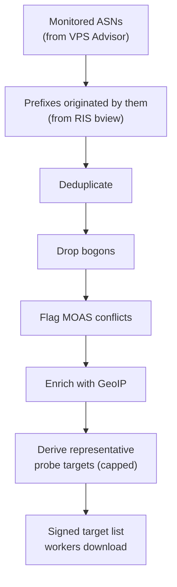

# Prefix Ownership: Deciding What Belongs to a Provider

**Problem this solves:** the whole system rests on one claim — *"this address
belongs to the provider we're monitoring."* If that claim is wrong, VAPN either
probes addresses it shouldn't (unfair, potentially abusive) or misjudges a
provider's health. This page explains how VAPN establishes prefix ownership
correctly and conservatively.

Prerequisites: [ASN & BGP](asn-and-bgp.md) (origin AS, MOAS) and
[RIPE, RIS & MRT](ripe-and-ris.md) (where the data comes from).

## Ownership = origin AS, mostly

The starting rule is simple and follows directly from how BGP works:

> A prefix belongs to a provider if its **origin AS** (the AS that originates
> the announcement in the routing table) is one of the provider's monitored
> ASNs.

VPS Advisor tells VAPN which ASNs each provider owns. The RIS `bview` dump tells
VAPN which prefixes each ASN originates. Join those two and you have each
provider's prefix set. Most of the global table resolves cleanly this way.

But "mostly" is doing real work in that sentence. Three complications force VAPN
to be careful.

## Complication 1: duplicate prefixes

A single `bview` dump is recorded from many BGP *peers*, so the **same prefix
from the same origin AS appears many times** — once per peer that reported it.
A million-route table can contain several million raw records.

VAPN **deduplicates**: for the purpose of "does provider *P* announce
`203.0.113.0/24`?", ten peers reporting it and one peer reporting it mean the
same thing — *yes*. The builder collapses all records for a given
`(prefix, origin AS)` into a single fact.

```
raw MRT records (from many peers)          after dedup
203.0.113.0/24  origin AS64500  peer A  ┐
203.0.113.0/24  origin AS64500  peer B  ┼──►  203.0.113.0/24  origin AS64500
203.0.113.0/24  origin AS64500  peer C  ┘
```

> **Why duplicates exist, restated:** the dump isn't "the routing table" in the
> abstract — it's "what each of N peers told this collector." Agreement across
> peers is normal and expected; VAPN only needs the distinct facts.

## Complication 2: bogons and bogus announcements

Not every announcement in a global dump is legitimate. Some are **bogons** —
prefixes that must never appear in public routing:

- **Private ranges** (`10.0.0.0/8`, `192.168.0.0/16`, `172.16.0.0/12`) — for
  internal networks only.
- **Reserved / documentation ranges** (`203.0.113.0/24` is literally reserved
  for docs; `127.0.0.0/8` is loopback).
- **Absurd prefix lengths** — e.g. an IPv4 `/32` or wildly large blocks that
  indicate a leak or misconfiguration rather than a real allocation.

If VAPN let a bogon through, a worker might try to probe a private or reserved
address — meaningless at best, and the kind of thing that makes a monitoring
system look like an attacker at worst. So the builder runs a **bogon filter**
that drops these before they can become probe targets. (The filter lives in
`internal/routing/bogon`.)

## Complication 3: MOAS conflicts

Recall from [BGP](asn-and-bgp.md#the-origin-as-who-owns-a-prefix) that a prefix
can be announced by **multiple origin ASes** at once — a **MOAS** (Multiple
Origin AS). This is ambiguous ownership, and VAPN refuses to guess:

- Sometimes it's legitimate (one company announcing from two of its own ASNs,
  anycast, migrations).
- Sometimes it's a **route leak or hijack** — someone announcing a prefix they
  don't own.

Either way, if a prefix's origin is ambiguous, treating it as definitely
belonging to a monitored provider could be wrong. So VAPN **flags MOAS
conflicts** (`flags: {moas_conflict: true}` on the prefix row) rather than
silently resolving them. Flagged prefixes are visible to administrators for
review and can be excluded from probing. The guiding principle:

> **When ownership is ambiguous, surface it — never guess.** A wrong "yes"
> pointed a fleet of workers at someone else's network.

The same principle applies one level up: VPS Advisor enforces that **one ASN
belongs to exactly one provider** (a uniqueness constraint). If two providers
claim the same ASN, VAPN hard-errors and asks a human to resolve it, rather than
splitting or duplicating measurements. See
[domain model](../architecture/02-domain-model.md).

## From owned prefixes to probe targets

Knowing a provider owns `203.0.113.0/24` (256 addresses) doesn't mean VAPN
probes all 256. That would be wasteful and could look like a scan. Instead the
builder derives a small set of **probe targets** — representative addresses per
prefix/region — with a recorded *rationale* for why each was chosen. Workers
probe these targets, not entire blocks. The number per provider is capped
(`MAX_TARGETS_PER_PROVIDER`, default 100).



## Snapshots make ownership a point-in-time fact

Routing changes over time — providers add and drop prefixes. VAPN captures
ownership as an immutable, versioned **routing snapshot** (see
[snapshot lifecycle](../architecture/06-lifecycles.md#2-snapshot-lifecycle)).
Each snapshot is "the truth about who owned what, as of this build." Two
benefits:

1. **Diffing** two snapshots reveals routing churn — prefixes that appeared or
   vanished — feeding [anomaly detection](measurement-and-consensus.md).
2. **Reproducibility** — a measurement can be tied to the exact snapshot that
   authorized its target, so "why did we probe this?" always has an answer.

A worker even carries the current snapshot locally (as its signed SQLite file)
and uses it to *re-check* that a target is still legitimate before probing —
defense in depth against a stale or tampered assignment.

## Key terms from this page

| Term | Meaning |
|---|---|
| **Prefix ownership** | The claim that a prefix belongs to a provider, via origin AS |
| **Deduplication** | Collapsing many peer reports of the same prefix into one fact |
| **Bogon** | A prefix that must never appear in public routing (private/reserved/absurd) |
| **MOAS conflict** | A prefix with multiple origin ASes — ambiguous ownership, flagged not guessed |
| **Probe target** | A representative address chosen from a prefix; what workers actually probe |
| **Routing snapshot** | An immutable, versioned record of ownership at build time |

Next: [GeoIP](geoip.md) — attaching geography to prefixes so verdicts can be
regional.
