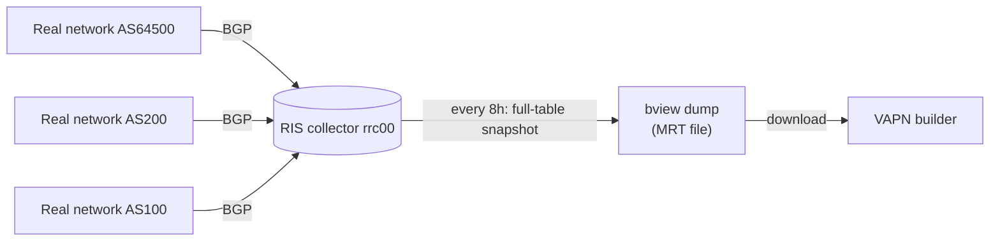

# RIPE, RIS & MRT: Where Routing Is Recorded

**Problem this solves:** VAPN needs to know every prefix each monitored provider
announces — but it doesn't participate in [BGP](asn-and-bgp.md) itself. Instead
it reads a global *recording* of BGP made by **RIPE RIS** and stored in **MRT**
files. This page explains who RIPE is, what RIS records, what an MRT file is,
and why VAPN uses it.

## RIPE NCC: one of the Internet's registries

Someone has to hand out IP address blocks and ASNs so they don't collide. That
job is split by region among five **Regional Internet Registries (RIRs)**:

| RIR | Region |
|---|---|
| **RIPE NCC** | Europe, Middle East, Central Asia |
| ARIN | North America |
| APNIC | Asia-Pacific |
| LACNIC | Latin America & Caribbean |
| AFRINIC | Africa |

**RIPE NCC** (Réseaux IP Européens Network Coordination Centre) is the European
one. Beyond allocating addresses and ASNs, RIPE runs a valuable public service
for the whole Internet: **RIS**.

> You don't need to know registry politics. The one thing that matters: RIPE
> operates a free, public, global recording of BGP that anyone can download —
> and VAPN uses it.

## RIS: the Routing Information Service

The **Routing Information Service (RIS)** is a network of **route collectors**
that RIPE runs around the world. Each collector is a machine that peers with
many real networks and *listens* to their [BGP announcements](asn-and-bgp.md) —
but never announces anything itself. It's a passive tape recorder for global
routing.

Each collector is named `rrc00`, `rrc01`, … (Remote Route Collector). VAPN's
builder defaults to `rrc00`, a well-connected multi-hop collector that sees a
broad view of the global routing table.

RIS produces two kinds of data:

- **Updates** — a continuous stream of individual announce/withdraw events (the
  play-by-play).
- **RIB dumps** (also called **`bview`** dumps) — a periodic full snapshot of
  the entire routing table as the collector currently sees it, taken every 8
  hours. RIB = Routing Information Base, the router's term for "my current table
  of all known routes."

**VAPN uses the `bview` dumps.** It doesn't need the second-by-second play-by-
play; it needs "what is the complete current set of prefixes for these ASNs?" —
which is exactly a full-table snapshot. Comparing two daily snapshots is also
how VAPN spots routing churn without processing the raw update firehose.



## MRT: the file format the recording lives in

RIS dumps are stored in **MRT** format — **M**ulti-**T**hreaded **R**outing
**T**oolkit format, a long-standing standard (RFC 6396) for recording routing
information. Think of it as the standard "container format" for BGP data, the
way PCAP is the standard container for captured packets.

An MRT `bview` file is a compact **binary** sequence of records. Each record, at
the level VAPN cares about, says essentially:

```
prefix 203.0.113.0/24  originated by AS64500  (plus AS path, timestamps, peer info)
```

A single full-table dump contains on the order of **a million** such entries —
the entire global routing table. The files are gzip-compressed and are tens to
a few hundred megabytes.

### Why MRT (and why binary)?

- **It's the standard.** Every routing tool, collector, and archive speaks MRT.
  Using it means VAPN interoperates with RIPE's data directly, with no
  bespoke format in between.
- **It's compact.** A million routes in a human-readable format would be
  enormous; MRT's binary encoding keeps full dumps to a manageable size.
- **It's complete.** A `bview` dump is the *whole* table, so VAPN can be sure it
  hasn't missed a prefix for a monitored ASN.

### Why workers never touch MRT

Parsing a million-entry binary file is heavy, and it requires the RIPE download,
a parser, and validation logic. VAPN does this **exactly once, centrally**, in
the [builder](../builder/README.md), and hands workers a tiny, pre-digested,
signed **SQLite** file containing only the finished target list. This is a
deliberate boundary:

> **The builder is the only component that ever reads MRT or MaxMind data.**
> Workers consume finished artifacts only — they never parse routing files,
> never download from RIPE, and never make ownership decisions.

This keeps community workers tiny (a few MB of RAM), keeps the expensive parsing
in one auditable place, and means the routing logic can be fixed or improved
without touching thousands of deployed workers.

## From MRT to "provider *P*'s prefixes"

The builder's job, covered in depth in [the builder guide](../builder/README.md)
and [prefix ownership](prefix-ownership.md), is roughly:

1. Get the list of monitored ASNs from VPS Advisor.
2. Download the latest RIS `bview` MRT dump.
3. Stream through its ~1M records, **keeping only** those whose origin AS is in
   the monitored set.
4. Deduplicate, validate (drop bogons, flag MOAS conflicts), enrich with
   [GeoIP](geoip.md).
5. Store the result and publish a signed target artifact.

Note step 3: VAPN reads the *whole* global table but *keeps* only the tiny slice
that belongs to monitored providers. It never builds a database of the entire
Internet — an explicit design constraint from the project brief.

## A note on the pre-downloaded data

To make development fast and offline-friendly, this repository ships a
pre-downloaded RIS dump and MaxMind databases under `data/`
(`data/ripe/latest-bview.gz`, `data/geo-data/`). The builder points at these by
default in development, so you can run the whole pipeline without fetching
anything from RIPE or MaxMind. In production the builder downloads fresh data on
its own schedule.

## Key terms from this page

| Term | Meaning |
|---|---|
| **RIPE NCC** | The regional Internet registry for Europe; runs RIS |
| **RIR** | Regional Internet Registry (RIPE, ARIN, APNIC, LACNIC, AFRINIC) |
| **RIS** | Routing Information Service — RIPE's global BGP recording |
| **Route collector / rrc** | A passive machine that records BGP announcements |
| **RIB / `bview` dump** | A full-table snapshot of routing, taken every 8h |
| **MRT** | The binary file format (RFC 6396) routing recordings are stored in |
| **Origin AS filtering** | Keeping only prefixes originated by monitored ASNs |

Next: [Prefix ownership](prefix-ownership.md) — how VAPN turns a million raw MRT
records into a trustworthy, de-duplicated list of a provider's addresses.
