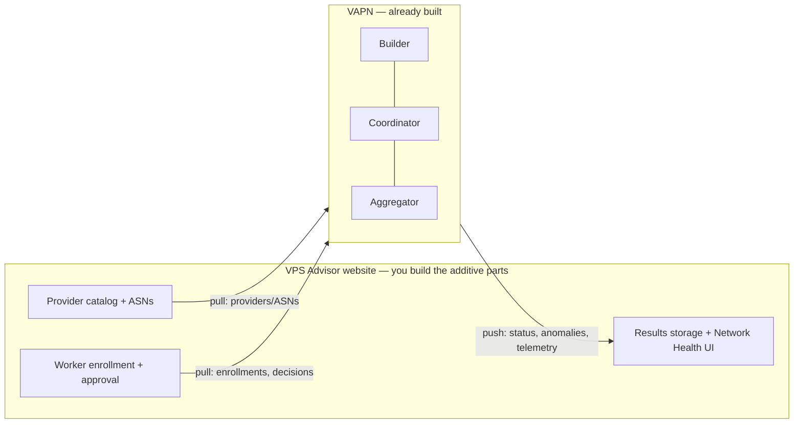

# VPS Advisor Integration

This section is for the **VPS Advisor website engineering team**. It specifies
everything the website must add so VAPN (this repository, "the platform") can
operate against it. The website already exists and is in production — nothing
here redesigns or rebuilds it; it's purely additive.

> **The key promise:** the platform side of every flow here is already
> implemented and tested against a stub of this exact contract
> (`internal/mockadvisor`). Implement to this specification and integration on
> the platform side is a config change (`VAPN_ADVISOR_URL` + credential) — the
> same contract tests that run against our stub in CI can run against your
> staging environment.

## Documents

| Document | For |
|---|---|
| [**Django integration guide**](django-integration.md) | The complete, canonical implementation: models, migrations, DRF endpoints, auth, Celery tasks, admin, permissions, signals, caching, testing, rollout |
| [API Reference → VPS Advisor endpoints](../api/README.md#a-vps-advisor-endpoints) | Endpoint inventory with schemas and errors |
| [Architecture 04 — API contracts](../architecture/04-api-contracts.md) | The design record behind the three API surfaces |

## The boundary in one picture

Four flows cross the boundary. The website is the **source of truth and human
surface**; the platform is the **measurement machine**.

| Flow | Direction | Cadence |
|---|---|---|
| Provider catalog | platform **pulls** | ~2 min |
| Worker enrollment & admin decisions | platform **pulls** | ~2 min |
| Aggregated results & anomalies | platform **pushes** | ~15 s outbox drain |
| Fleet telemetry | platform **pushes** | ~5 min |

The platform never calls user-facing pages, stores no provider business data
beyond IDs/names/ASNs/priority, and tolerates website downtime (pulls retry;
pushes queue in an idempotent outbox with backoff).

Start with the [Django integration guide](django-integration.md).
