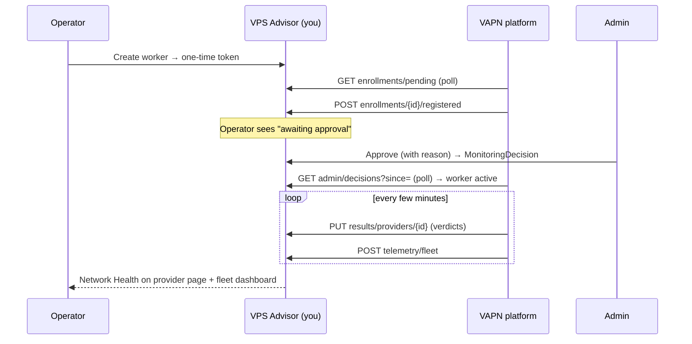

# VPS Advisor Django Integration Guide

**Audience:** the VPS Advisor website engineering team (Django/DRF).
**Goal:** everything the website must add so VAPN can operate against it —
models, migrations, endpoints, authentication, tasks, admin, permissions,
testing, and rollout — in enough detail that you could implement it **without
ever reading the platform's code**.

The platform side is already built and tested against a stub of this exact
contract ([`internal/mockadvisor`](../../internal/mockadvisor/server.go)).
Implement to this document and platform-side integration is just
`VAPN_ADVISOR_URL` + a credential.

> This guide uses Django + Django REST Framework + Celery idioms because that's
> the VPS Advisor stack. Adapt names/types to your conventions; the **contract**
> (paths, payloads, semantics) is what must match. For the design rationale
> behind the three API surfaces, see
> [architecture 04 — API contracts](../architecture/04-api-contracts.md).

## Contents

1. [Mental model & the four flows](#1-mental-model)
2. [Authentication](#2-authentication)
3. [Database models & migrations](#3-database-models--migrations)
4. [Endpoints](#4-endpoints) — with request/response/validation/errors
5. [Permissions](#5-permissions)
6. [Celery tasks & background jobs](#6-celery-tasks--background-jobs)
7. [Signals](#7-signals)
8. [Caching](#8-caching)
9. [Django admin & dashboard pages](#9-django-admin--dashboard-pages)
10. [Management commands](#10-management-commands)
11. [Security considerations](#11-security-considerations)
12. [Testing strategy](#12-testing-strategy)
13. [Deployment & rollout order](#13-deployment--rollout-order)
14. [Operational workflow](#14-operational-workflow)

---

## 1. Mental model

The website is the **source of truth and human surface**; the platform is the
**measurement machine**. Four flows cross the boundary:

| #   | Flow                            | Direction           | Cadence        | Endpoints                                    |
| --- | ------------------------------- | ------------------- | -------------- | -------------------------------------------- |
| 1   | Provider catalog                | platform **pulls**  | ~2 min         | [4.1](#41-provider-catalog-platform-pulls)   |
| 2   | Enrollment                      | platform **pulls**  | ~2 min         | [4.2](#42-enrollment)                        |
| 3   | Admin decisions                 | platform **pulls**  | ~2 min         | [4.3](#43-admin-decisions)                   |
| 4   | Results / anomalies / telemetry | platform **pushes** | ~15 s / ~5 min | [4.4](#44-results-ingestion-platform-pushes) |

Design rules to internalize:

- **You never store measurements or run probes.** You store _inputs_ (which
  providers/ASNs to monitor) and _outputs_ (verdicts to display).
- **Every push endpoint must be idempotent** — the platform delivers
  at-least-once from an outbox with retries. A replayed push must be a no-op.
- **Pulls are cheap and tolerant.** Returning the full list is always correct;
  `updated_since`/`since` cursors are optimizations.
- **Identities align.** The website generates the worker `uuid`; the platform
  adopts it verbatim. There is one worker identity, shared.

## 2. Authentication

Two distinct auth surfaces:

### 2a. Platform ↔ website (server-to-server)

One **service credential** scoped to the `/api/v1/monitoring/*` namespace. A
static bearer token is the minimum; HMAC or mTLS if your stack prefers.

```
Authorization: Bearer <platform-service-token>
```

Implement as a DRF authentication/permission class:

```python
# monitoring/auth.py
from rest_framework.permissions import BasePermission
from django.conf import settings
import hmac

class IsPlatformService(BasePermission):
    """Authenticates the VAPN platform via a scoped bearer token."""
    def has_permission(self, request, view):
        auth = request.headers.get("Authorization", "")
        if not auth.startswith("Bearer "):
            return False
        token = auth.removeprefix("Bearer ")
        # constant-time compare against the configured platform token(s)
        return any(hmac.compare_digest(token, t)
                   for t in settings.MONITORING_PLATFORM_TOKENS if t)
```

**Rotation:** keep `MONITORING_PLATFORM_TOKENS` a list — issue a second token,
update the platform config, then drop the old one. Never a hard cutover.

> **Alert on `401`/`403` from this credential.** A sudden spike means contract
> drift or a rotation gone wrong, not an attacker (the platform calls from a
> small set of egress IPs you'll be given — allowlist them too).

### 2b. Humans (operators, providers, admins)

Your existing session auth, plus three new [permissions](#5-permissions). No new
auth mechanism needed for people.

## 3. Database models & migrations

Add a `monitoring` app. Suggested models (adapt types/names):

```python
# monitoring/models.py
import uuid
from django.db import models
from django.conf import settings

class WorkerState(models.TextChoices):
    PENDING     = "pending"
    ACTIVE      = "active"
    SUSPENDED   = "suspended"
    QUARANTINED = "quarantined"
    RETIRED     = "retired"

class MonitoringWorker(models.Model):
    # The website generates this id; the platform adopts it verbatim.
    id           = models.UUIDField(primary_key=True, default=uuid.uuid4, editable=False)
    operator     = models.ForeignKey(settings.AUTH_USER_MODEL, on_delete=models.CASCADE,
                                     related_name="monitoring_workers")
    name         = models.CharField(max_length=200)
    state        = models.CharField(max_length=16, choices=WorkerState.choices,
                                    default=WorkerState.PENDING)
    state_reason = models.TextField(blank=True)
    created_at   = models.DateTimeField(auto_now_add=True)
    updated_at   = models.DateTimeField(auto_now=True)

class MonitoringEnrollment(models.Model):
    id            = models.UUIDField(primary_key=True, default=uuid.uuid4, editable=False)
    worker        = models.ForeignKey(MonitoringWorker, on_delete=models.CASCADE,
                                      related_name="enrollments")
    token_hash    = models.BinaryField()          # sha256 of the one-time token
    expires_at    = models.DateTimeField()         # suggest 24–72h
    registered_at = models.DateTimeField(null=True, blank=True)  # set on platform ack
    created_at    = models.DateTimeField(auto_now_add=True)

class MonitoringDecision(models.Model):
    id         = models.UUIDField(primary_key=True, default=uuid.uuid4, editable=False)
    worker     = models.ForeignKey(MonitoringWorker, on_delete=models.CASCADE,
                                   related_name="decisions")
    state      = models.CharField(max_length=16, choices=WorkerState.choices)  # minus pending
    reason     = models.TextField()
    decided_by = models.ForeignKey(settings.AUTH_USER_MODEL, on_delete=models.SET_NULL, null=True)
    decided_at = models.DateTimeField(auto_now_add=True, db_index=True)  # platform polls ?since=

class MonitoringProviderStatus(models.Model):
    provider   = models.OneToOneField("catalog.Provider", on_delete=models.CASCADE,
                                      primary_key=True, related_name="monitoring_status")
    document   = models.JSONField()                # verbatim platform payload (4.4)
    updated_at = models.DateTimeField(auto_now=True)

class MonitoringAnomaly(models.Model):
    # (provider, kind, opened_at) is the idempotency key.
    provider    = models.ForeignKey("catalog.Provider", on_delete=models.CASCADE,
                                    related_name="monitoring_anomalies")
    kind        = models.CharField(max_length=32)  # reachability_loss|latency_regression|routing_churn
    severity    = models.CharField(max_length=16)
    document    = models.JSONField()
    opened_at   = models.DateTimeField()
    resolved_at = models.DateTimeField(null=True, blank=True)
    class Meta:
        constraints = [models.UniqueConstraint(
            fields=["provider", "kind", "opened_at"], name="uniq_anomaly")]

class MonitoringFleetTelemetry(models.Model):
    document   = models.JSONField()
    updated_at = models.DateTimeField(auto_now=True)   # a single row is fine
```

### Provider model additions

On your existing `Provider` (and a join table for ASNs):

```python
class Provider(models.Model):
    # ... existing fields ...
    monitoring_enabled  = models.BooleanField(default=False)  # the opt-out toggle
    monitoring_priority = models.IntegerField(default=100)    # lower = probed more often

class ProviderASN(models.Model):
    provider = models.ForeignKey(Provider, on_delete=models.CASCADE, related_name="asns")
    asn      = models.BigIntegerField(unique=True)   # ← CRITICAL: one ASN, one provider
```

> **The `asn` uniqueness constraint is not optional.** The platform hard-errors
> on an ASN claimed by two providers rather than guessing — [it will not split
> or duplicate measurements](../concepts/prefix-ownership.md#complication-3-moas-conflicts).
> Enforce it at the database level.

Then `python manage.py makemigrations monitoring && migrate`.

## 4. Endpoints

All JSON; errors as **RFC 7807** `application/problem+json`; paginate with
`next_cursor` (the platform follows it when non-null). Base path
`/api/v1/monitoring/`. Wire them up:

```python
# monitoring/urls.py
from django.urls import path
from . import views
urlpatterns = [
    path("providers",                         views.ProviderList.as_view()),
    path("providers/<slug:provider_id>",      views.ProviderDetail.as_view()),
    path("asns",                              views.ASNList.as_view()),
    path("workers",                           views.WorkerList.as_view()),
    path("workers/<uuid:pk>/regenerate-token",views.RegenerateToken.as_view()),
    path("enrollments/pending",               views.PendingEnrollments.as_view()),
    path("enrollments/<uuid:pk>/registered",  views.EnrollmentRegistered.as_view()),
    path("admin/decisions",                   views.DecisionList.as_view()),
    path("results/providers/<slug:provider_id>", views.ResultUpsert.as_view()),
    path("results/anomalies",                 views.AnomalyIngest.as_view()),
    path("results/history",                   views.HistoryIngest.as_view()),
    path("telemetry/fleet",                   views.FleetTelemetry.as_view()),
]
```

### 4.1 Provider catalog (platform pulls)

**`GET /api/v1/monitoring/providers?enabled=true&updated_since=<RFC3339>&cursor=`**

- **Purpose:** the list of providers eligible for monitoring, with their ASNs.
- **Auth:** platform service token.
- **Query:** `enabled=true` filters to `monitoring_enabled`; `updated_since`
  is an optimization; `cursor` for pagination.
- **Response 200:**

```json
{
  "providers": [
    {
      "provider_id": "examplehost",
      "name": "ExampleHost",
      "asns": [64500, 64501],
      "monitoring_enabled": true,
      "priority": 10,
      "updated_at": "2026-07-18T06:00:00Z"
    }
  ],
  "next_cursor": null
}
```

- **Semantics:** a provider **absent** from the enabled list is treated as
  opted-out/delisted and drained platform-side. Returning the full list is
  always correct.
- **`provider_id` is opaque to the platform** — a stable, unique string of at
  most 255 characters. Your **slug** is the right choice and what the reference
  implementation publishes: an autoincrement primary key is not stable across a
  database restore, and the platform's stored measurements are keyed on
  whatever you send. Whatever you pick, never change it for an existing
  provider; that reads platform-side as one provider disappearing and another
  appearing.
- **Errors:** `401` bad token.

```python
# monitoring/views.py (illustrative)
class ProviderList(APIView):
    permission_classes = [IsPlatformService]
    def get(self, request):
        qs = Provider.objects.prefetch_related("asns")
        if request.query_params.get("enabled") == "true":
            qs = qs.filter(monitoring_enabled=True)
        if since := request.query_params.get("updated_since"):
            qs = qs.filter(updated_at__gt=parse_datetime(since))
        page, next_cursor = cursor_paginate(qs.order_by("id"), request)
        return Response({"providers": [serialize_provider(p) for p in page],
                         "next_cursor": next_cursor})
```

**`GET /api/v1/monitoring/providers/{id}`** — the same object; `404` if unknown.

**`GET /api/v1/monitoring/asns?updated_since=`** — flat mapping for cheap delta
sync (optional but recommended):

```json
{ "asns": [{ "asn": 64500, "provider_id": "7f9c...", "monitoring_enabled": true, "updated_at": "..." }], "next_cursor": null }
```

### 4.2 Enrollment

**Operator UI flow** (session auth + `monitoring.operator`):

**`POST /api/v1/monitoring/workers`** — create a worker.

- Generate a random **≥32-byte token**, show its plaintext **once**, store only
  `sha256`. Create `MonitoringWorker` (state `pending`) + `MonitoringEnrollment`.
- **Response 201:** `{ "worker_id": "...", "enrollment_token": "<shown once>", "coordinator_url": "https://probe-api..." }`

**`POST /api/v1/monitoring/workers/{id}/regenerate-token`** — replace an
unused/expired token (same one-time display).

**`GET /api/v1/monitoring/workers`** — the operator's own workers + state (join
in liveness from pushed telemetry/status).

**Platform pull** (service token):

**`GET /api/v1/monitoring/enrollments/pending`** — enrollments not yet
`registered_at` and not expired:

```json
{
  "enrollments": [
    {
      "enrollment_id": "en-123",
      "worker_id": "9f30...",
      "worker_name": "helsinki-1",
      "operator_id": "user-uuid",
      "token_hash": "hex sha256",
      "expires_at": "2026-07-19T08:00:00Z"
    }
  ],
  "next_cursor": null
}
```

**`POST /api/v1/monitoring/enrollments/{id}/registered`** — the platform has
provisioned the worker; set `registered_at`. **`204`. Idempotent** (a second
call is a no-op).

### 4.3 Admin decisions

Admin UI actions (approve / suspend / quarantine / retire, each with a
**required reason**) create `MonitoringDecision` rows. The platform polls:

**`GET /api/v1/monitoring/admin/decisions?since=<RFC3339>`**

- Return decisions with `decided_at > since`, **oldest first**.
- **Response 200:**

```json
{
  "decisions": [
    {
      "decision_id": "d-1",
      "worker_id": "9f30...",
      "state": "active",
      "reason": "verified operator",
      "decided_at": "2026-07-18T09:00:00Z"
    }
  ],
  "next_cursor": null
}
```

- The platform applies decisions **idempotently** (replays/no-ops safe) within
  ~2 min. Lifecycle semantics to reflect in your UI:
  [pending](../worker/lifecycle.md#pending) heartbeats but gets no work;
  [suspended](../worker/lifecycle.md#suspended) is locked out;
  [quarantined](../worker/lifecycle.md#quarantined-shadow-mode) measures at zero
  weight; [retired](../worker/lifecycle.md#retired) is terminal.

> **Optional webhook:** POST the same decision object to the platform to cut
> latency. Polling stays the fallback, so the webhook is a pure optimization —
> you never _depend_ on it.

### 4.4 Results ingestion (platform pushes)

All idempotent; respond `2xx` quickly (`202` fine). Non-2xx is retried with
backoff — transient `5xx` is harmless, persistent failure backs up the queue.

**`PUT /api/v1/monitoring/results/providers/{provider_id}`** — upsert current
status:

```json
{ "provider_id": "alexhost-com", "as_of": "2026-08-17T08:05:00Z",
  "global":   { "verdict": "degraded", "confidence": 0.91, "metrics": { "loss_rate": 0.001, "rtt_p50_ms": 21.4, "rtt_p95_ms": 38.2, "worker_count": 14, "dissent_ratio": 0.02 } },
  "regions":  [ { "region": "MD", "country": "Moldova", "continent": "Europe", "verdict": "healthy", "confidence": 0.93, "metrics": { "…": 0 }, "coverage": { "targets_total": 10, "targets_measured": 10, "targets_up": 10 }, "as_of": "2026-08-17T08:05:00Z" } ],
  "network":  { "snapshot_version": "20260817T0800Z-…", "asns": [200019], "ipv4_addresses": 39680, "countries": [ { "country_code": "MD", "country": "Moldova", "continent": "Europe", "ipv4_addresses": 21504, "ipv4_share_pct": 54.19, "monitored_targets": 10 } ] },
  "networks": [ { "prefix": "176.123.0.0/21", "origin_asn": 200019, "target": "176.123.0.1", "country_code": "MD", "city": "Chisinau", "verdict": "healthy", "availability": 0.9998, "rtt_p50_ms": 18.0, "last_measured_at": "2026-08-17T08:04:31Z" } ] }
```

Full field-by-field schema: [API reference](../api/README.md#a4-results-ingestion-platform-pushes--idempotent).

- **Verdicts:** `healthy | degraded | outage | insufficient_data`.
- **Idempotent upsert** keyed by `provider_id`. Store the document verbatim —
  `MonitoringProviderStatus.document` needs no schema change to hold the newer
  shape, and **unknown fields must be accepted and stored**, since this document
  grows over time.
- **Display guidance (important):** these are _public-network reachability_
  signals, **not SLA claims**. Always render `insufficient_data` as "not enough
  data," never as an outage. Show confidence.

**Rendering the geography.** The document deliberately separates two things
your templates should not blend:

| Section | Question it answers | Suggested UI |
|---|---|---|
| `network.countries` | *Where is this provider's network?* | "IPv4 distribution" — a bar or map keyed on `ipv4_share_pct`, sorted by `ipv4_addresses` |
| `regions` | *How is it performing in each country?* | "Regional monitoring" — group by `continent`, one row per country with verdict, latency, loss |
| `networks` | *Which specific networks are monitored, and how are they?* | "Monitored networks" table — prefix, country/city, uptime, latency, loss |

- `network` is derived from BGP and GeoIP; it is present even before anyone has
  probed the provider. `regions` and `networks` are measurements. A country can
  hold 54% of the address space and have no `regions` entry at all — render
  that as "not monitored here yet", never as an outage.
- `ipv4_share_pct` is already address-weighted (a `/20` counts sixteen times a
  `/24`); do not recompute shares from prefix counts.
- **`country_code` is ISO 3166-1 alpha-2, plus `ZZ`** for address space MaxMind
  does not place. Render `ZZ` as "Unknown", never as a country, and consider
  hiding it when its share is negligible.
- `networks[]` covers the prefixes that carry a probe target (capped
  per provider), not every announced prefix — `network.countries` is the
  complete footprint.

```python
# Rendering helpers over the stored document.
doc = provider.monitoring_status.document
distribution = doc.get("network", {}).get("countries", [])       # where the network is
by_country   = {r["region"]: r for r in doc.get("regions", [])}  # how it behaves
for country in distribution:
    measured = by_country.get(country["country_code"])           # may be None
    ...
```

**`POST /api/v1/monitoring/results/anomalies`** — anomaly documents
(`kind: reachability_loss | latency_regression | routing_churn`, `severity`,
`opened_at`, nullable `resolved_at`, `evidence`). Idempotency key
`(provider, kind, opened_at)`. Drives "recent instability" UI + notifications.

**`POST /api/v1/monitoring/results/history`** — periodic rollup batches for
charts (optional at launch; accept-and-store, payloads up to ~1 MB).

**`POST /api/v1/monitoring/telemetry/fleet`** — admin-dashboard summary:

```json
{ "as_of": "...", "workers_by_state": { "active": 41, "pending": 3 }, "software_versions": { "1.2.0": 39, "1.1.2": 2 }, "published_snapshot": "20260718T0800Z-1723118400000", "security_events_24h": { "replay": 0, "bad_signature": 2 } }
```

```python
class ResultUpsert(APIView):
    permission_classes = [IsPlatformService]
    def put(self, request, pk):
        provider = get_object_or_404(Provider, pk=pk)
        MonitoringProviderStatus.objects.update_or_create(
            provider=provider, defaults={"document": request.data})
        return Response(status=202)   # fast ack; render from stored doc later
```

## 5. Permissions

Three new permissions (map to your groups/roles):

| Permission            | Grants                                     | Typical holder                             |
| --------------------- | ------------------------------------------ | ------------------------------------------ |
| `monitoring.operator` | create/manage own workers                  | any eligible registered user (your policy) |
| `monitoring.provider` | the `monitoring_enabled` opt-out toggle    | existing provider-claim role               |
| `monitoring.admin`    | approval queue, decisions, fleet dashboard | staff                                      |

```python
class HasMonitoringAdmin(BasePermission):
    def has_permission(self, request, view):
        return request.user.has_perm("monitoring.admin")
```

## 6. Celery tasks & background jobs

```python
# monitoring/tasks.py
from celery import shared_task
from django.utils import timezone
from datetime import timedelta

@shared_task
def expire_stale_enrollments():
    """Hourly: mark expired, unregistered enrollments unusable."""
    MonitoringEnrollment.objects.filter(
        registered_at__isnull=True, expires_at__lt=timezone.now()
    ).delete()

@shared_task
def prune_monitoring_history():
    """Daily: trim old decisions/telemetry/history rows."""
    cutoff = timezone.now() - timedelta(days=90)
    MonitoringDecision.objects.filter(decided_at__lt=cutoff).delete()

@shared_task
def notify_worker_state_change(worker_id, new_state, reason):
    """Fired from the decision signal (7) — email/notify the operator."""
    ...
```

Schedule with Celery Beat:

```python
CELERY_BEAT_SCHEDULE = {
  "expire-stale-enrollments": {"task": "monitoring.tasks.expire_stale_enrollments",
                               "schedule": crontab(minute=0)},
  "prune-monitoring-history": {"task": "monitoring.tasks.prune_monitoring_history",
                               "schedule": crontab(hour=3, minute=0)},
}
```

> **You do not need a task to _push_ to the platform** — the platform pulls the
> catalog/enrollments/decisions itself. Your jobs are just housekeeping and
> notifications.

## 7. Signals

Use signals to react to admin decisions and status changes without coupling
views to notifications:

```python
# monitoring/signals.py
from django.db.models.signals import post_save
from django.dispatch import receiver
from .models import MonitoringDecision, MonitoringAnomaly
from .tasks import notify_worker_state_change

@receiver(post_save, sender=MonitoringDecision)
def on_decision(sender, instance, created, **kwargs):
    if created:
        instance.worker.state = instance.state
        instance.worker.state_reason = instance.reason
        instance.worker.save(update_fields=["state", "state_reason", "updated_at"])
        notify_worker_state_change.delay(str(instance.worker_id),
                                         instance.state, instance.reason)

@receiver(post_save, sender=MonitoringAnomaly)
def on_anomaly(sender, instance, created, **kwargs):
    if created and instance.resolved_at is None:
        # notify the provider (respect their opt-out), surface on admin feed
        ...
```

## 8. Caching

- **Provider catalog / ASN endpoints:** cache the serialized response briefly
  (30–60 s). The platform polls every ~2 min and tolerates slight staleness, so
  a short cache absorbs the load with no correctness cost. Invalidate on
  provider/ASN save.
- **Public Network Health section:** cache the rendered status card per provider
  (e.g. 60 s); it's read far more than it's written (~1 update/5 min/provider).
- **Do not cache** enrollment/decision pulls (they're low-volume and must be
  fresh) or result upserts (writes).

```python
from django.core.cache import cache
def enabled_providers_payload():
    key = "monitoring:providers:enabled"
    if (cached := cache.get(key)) is None:
        cached = build_enabled_providers_payload()
        cache.set(key, cached, timeout=45)
    return cached
```

## 9. Django admin & dashboard pages

### Django admin (staff)

```python
# monitoring/admin.py
from django.contrib import admin
from .models import MonitoringWorker, MonitoringDecision, MonitoringAnomaly

@admin.register(MonitoringWorker)
class WorkerAdmin(admin.ModelAdmin):
    list_display = ("id", "name", "operator", "state", "updated_at")
    list_filter  = ("state",)
    search_fields = ("id", "name", "operator__username")
    actions = ["approve", "suspend", "quarantine", "retire"]
    # each action creates a MonitoringDecision(reason=...) so the platform syncs it
```

### Dashboard pages to add

| Audience                    | Page                   | Contents                                                                                                                        |
| --------------------------- | ---------------------- | ------------------------------------------------------------------------------------------------------------------------------- |
| **Operator** ("My Workers") | worker list            | state/liveness, **create worker + one-time token (copy-once UX)**, regenerate token, retire own worker (writes a decision)      |
| **Provider manager**        | monitoring toggle      | `monitoring_enabled` opt-out (copy: "takes effect within minutes, no commitment") + their status card                           |
| **Admin**                   | approval queue         | pending workers with operator context; **decision actions with required reason**                                                |
| **Admin**                   | fleet overview         | from `MonitoringFleetTelemetry`: counts by state/version, snapshot in force, security events                                    |
| **Admin**                   | worker detail          | state history (from decisions), trust/security surfaced via telemetry, anomaly feed, audit trail                                |
| **Public**                  | Network Health section | rendered from `MonitoringProviderStatus` + recent anomalies, with the [display guidance](#44-results-ingestion-platform-pushes) |

## 10. Management commands

Handy operational commands to ship:

```python
# monitoring/management/commands/monitoring_seed_token.py
class Command(BaseCommand):
    """Issue an enrollment token from the CLI (bootstrap before the UI ships)."""
    def handle(self, *args, **opts):
        worker = MonitoringWorker.objects.create(operator=..., name=opts["name"])
        token = secrets.token_urlsafe(32)
        MonitoringEnrollment.objects.create(
            worker=worker, token_hash=hashlib.sha256(token.encode()).digest(),
            expires_at=timezone.now() + timedelta(days=2))
        self.stdout.write(token)   # show once
```

Others worth having: `monitoring_expire_enrollments` (manual trigger of the
task), `monitoring_fleet` (print the latest telemetry), `monitoring_check`
(verify the platform credential works end-to-end against staging).

## 11. Security considerations

- **Scope the service token** to `/api/v1/monitoring/*` only; allowlist the
  platform's egress IPs (provided).
- **Never store plaintext enrollment tokens** — only `sha256`. Show plaintext
  once, at creation.
- **Constant-time token comparison** (`hmac.compare_digest`).
- **Rate-limit** operator worker-creation to blunt token farming.
- **Require a reason on every decision** (audit trail) and keep decisions
  append-only.
- **Enforce ASN uniqueness at the DB layer** ([3](#3-database-models--migrations)).
- **Alert on `4xx` from the platform credential** — it signals contract drift.
- **Validate result payloads loosely but store verbatim** — accept unknown
  fields (forward compatibility), but sanity-check `verdict`/`kind` enums before
  rendering to the public.

Cross-reference the platform's [security model](../architecture/05-security-trust-model.md).

## 12. Testing strategy

- **Contract tests** are the centerpiece. The platform runs the same suite
  against its stub and against your staging environment — mirror them: for each
  endpoint, assert path, auth behavior (`401` without token), response shape,
  idempotency (replay a push → no dupes), and pagination.
- **Idempotency tests:** `PUT results` twice → one row; `POST anomalies` with
  same `(provider, kind, opened_at)` twice → one row; `POST enrollments/{id}/
registered` twice → `204` both times, one state change.
- **Pagination tests:** more than one page → `next_cursor` set, following it
  returns the rest, no overlaps/gaps.
- **Permission tests:** operator can't hit admin decisions; provider role can
  toggle only their own provider.
- **Fixture parity:** seed the same provider/worker fixtures the platform's
  `mockadvisor` uses so behavior matches.

```python
def test_results_upsert_is_idempotent(client, provider, platform_token):
    doc = {"provider_id": str(provider.id), "as_of": "...","global": {...}}
    for _ in range(2):
        r = client.put(f"/api/v1/monitoring/results/providers/{provider.id}",
                       doc, content_type="application/json",
                       HTTP_AUTHORIZATION=f"Bearer {platform_token}")
        assert r.status_code == 202
    assert MonitoringProviderStatus.objects.filter(provider=provider).count() == 1
```

## 13. Deployment & rollout order

Ship incrementally — each step is independently useful and de-risks the next:

1. **Models + 4.1 (catalog).** The platform can now run against production data
   **read-only** — it learns which providers/ASNs to monitor and starts building
   snapshots. No public change yet.
2. **4.4 (results).** Store and render Network Health → public status goes live.
3. **4.2 + 4.3 (enrollment + decisions).** Community workers onboard through
   the website. _Until this ships,_ workers are enrolled via the platform admin
   API (`vapnctl workers create`), so you're never blocked.
4. **Staging + service credential.** Provide a staging environment and token;
   the platform runs its contract tests against it (same suite as CI).

Provide the platform team: `VAPN_ADVISOR_URL`, the service token, and confirm
your egress-IP allowlist.

## 14. Operational workflow

Day-to-day once live:



- **A provider opts in/out:** toggle `monitoring_enabled`; effective platform-
  side within ~2 min.
- **An operator adds a worker:** create → token → it enrolls → admin approves →
  it's measuring. Notifications keep the operator informed.
- **An anomaly opens:** the platform pushes it; you notify the provider (respect
  opt-out) and show "recent instability."
- **Something's wrong:** watch for `4xx` from the platform credential (contract
  drift) and stale `updated_at` on statuses (platform not pushing — check the
  platform's [outbox depth](../operations/monitoring.md)).

That's the whole integration. Questions on any endpoint's exact bytes: the
[API Reference](../api/README.md) has the canonical schemas, and
[`internal/mockadvisor`](../../internal/mockadvisor/server.go) is a runnable
reference implementation of this contract.
