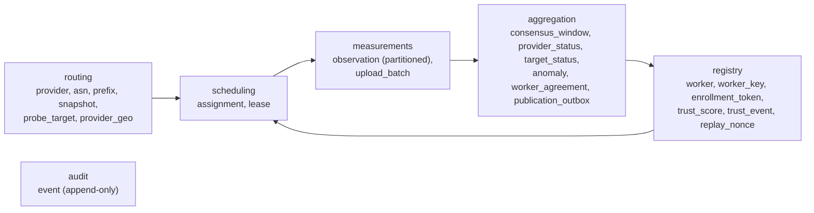

# Database Schema Reference

VAPN uses **one PostgreSQL cluster, one database, six schemas**. This page is a
table-by-table summary; the full DDL with column types, constraints, and index
notes is [architecture 03](../architecture/03-database-design.md), and the
authoritative source is [`migrations/`](../../migrations/) (one ordered SQL
stream applied by the `migrate` job).

## Conventions

- `bigint generated always as identity` PKs for high-volume tables; `uuid`
  external IDs where values cross system boundaries (worker/provider IDs align
  with VPS Advisor).
- `timestamptz` everywhere; `text` + `CHECK` for states that will evolve; native
  `cidr`/`inet` for routing.
- **One Postgres role per service, least privilege:** the builder can't touch
  `measurements`; the coordinator can't write `aggregation`; the aggregator reads
  `measurements` and writes `aggregation` + `registry.trust_*`.

## Schema map

## Schema `routing`

Owned by the builder; the canonical routing intelligence. Prefixes are
per-snapshot and immutable — diffing snapshots yields routing-churn signals.

| Table | Purpose | Key columns |
|---|---|---|
| `snapshot` | A versioned routing build | `version`, `status` (building/published/superseded/failed), `asn_count`, `prefix_count_*`, `artifact_sha256`, `artifact_signature` |
| `provider` | Cache of VPS Advisor providers | `provider_id` (**opaque text**, stored verbatim — VPS Advisor publishes its slug; see migration `0009`), `monitoring_enabled`, `priority`, `delisted_at` |
| `asn` | Monitored ASNs → provider | `asn` (pk), `provider_id`, registry name/country |
| `prefix` | Prefixes per snapshot | `snapshot_id`, `prefix` (cidr), `origin_asn`, geo columns, `flags` jsonb (bogon, moas_conflict) — GiST index on `prefix` |
| `probe_target` | Derived probeable addresses | `snapshot_id`, `provider_id`, `prefix_id`, `address` (inet), `rationale`, `active`, `geo_country`/`geo_city` (denormalized from the prefix, so measurements can be attributed to a country with one join) |
| `provider_geo` | A provider's address space by country, per snapshot | `snapshot_id`, `provider_id`, `country_code` (ISO-3166-1, or `ZZ` = unplaced), `country_name`, `continent_*`, `ipv4_addresses`, `ipv4_share`, `ipv6_net64s`, `prefix_count_*`, `target_count` |

**`provider_geo` counts *exclusive* address space.** A more-specific
announcement's addresses are subtracted from the covering announcement, so
`/16` + `/17` + `/24` is 65 536 addresses, not 98 560. `ipv4_share` is the
percentage of the provider's deduplicated IPv4 space — address-weighted, never
prefix-counted. `ipv6_net64s` counts `/64` networks because IPv6 address counts
do not fit in any integer type; announcements longer than `/64` contribute
none. How the numbers are produced:
[`internal/builder/distribution.go`](../../internal/builder/distribution.go).

## Schema `registry`

The worker registry and trust state.

| Table | Purpose | Key columns |
|---|---|---|
| `worker` | A worker node | `id` (uuid), `operator_id`, `state`, `software_version`, `verified_country`, `source_asn`, `last_heartbeat_at`, `config` jsonb |
| `worker_key` | Public keys with validity | `worker_id`, `public_key` (bytea), `valid_from/until`, `revoked_at` — partial unique index: one current key per worker |
| `enrollment_token` | One-time tokens | `token_hash` (sha256, pk), `worker_id`, `expires_at`, `used_at` — plaintext never stored |
| `trust_score` | Current trust per worker | `worker_id` (pk), `score` [0,1], `components` jsonb, `computed_at` |
| `trust_event` | Append-only trust/security events | `worker_id`, `event_type` (approved, suspended, disagreement, bad_signature, replay…), `actor`, `detail` |
| `replay_nonce` | Replay protection | `(worker_id, nonce, seen_at)`, short TTL pruning |

## Schema `scheduling`

| Table | Purpose | Key columns |
|---|---|---|
| `assignment` | Instruction to probe target T with type P at interval I | `target_id`, `provider_id`, `probe_type`, `interval_seconds`, `redundancy_group` (uuid), `status` (open/leased/draining/closed) |
| `lease` | A worker's time-bounded claim | `assignment_id`, `worker_id`, `expires_at` (renewed by heartbeat), `released_at` — partial unique index: one live lease per (assignment, worker) |

## Schema `measurements`

The write hotspot — **partitioned by day**, internal-only, immutable.

| Table | Purpose | Key columns |
|---|---|---|
| `observation` | One signed measurement | `worker_id`, `assignment_id`, `provider_id`, `target` (inet), `probe_type`, `measured_at` (worker clock), `received_at`, `ok`, `rtt_ms`, `packets_sent/lost`, `metrics` jsonb, `signature` — PK `(id, measured_at)`, range-partitioned by `measured_at` |
| `upload_batch` | Batch dedup / idempotency | batch id, `received_at` |

**Retention:** raw partitions dropped after N days (default 14); aggregates keep
history. Inserts are bulk (COPY-style).

## Schema `aggregation`

Consensus, public status, anomalies, and the publication outbox. Owned by the
aggregator.

| Table | Purpose | Key columns |
|---|---|---|
| `consensus_window` | Trust-weighted aggregate per (provider, region, probe_type, window) | `verdict`, `confidence`, `worker_count`, `dissent_ratio`, `loss_rate`, `rtt_p50/p95/p99` — unique on the tuple (idempotent settle) |
| `provider_status` | Current rollup, one row per (provider, region) | `verdict`, `confidence`, `since`, `metrics` jsonb, `updated_at` |
| `target_status` | Current health of each probed address (= each monitored network) | `provider_id`, `target` (inet), `region`, `prefix`, `origin_asn`, `city`, `verdict`, `availability`, `loss_rate`, `rtt_p50/p95`, `worker_count`, `last_measured_at` |
| `anomaly` | Detected events | `kind` (reachability_loss/latency_regression/routing_churn), `severity`, `opened_at`, `resolved_at`, `evidence` jsonb |
| `worker_agreement` | Per-worker agreement vs settled consensus | `worker_id`, `window_start`, `agreement`, `targets` — feeds trust scoring |
| `publication_outbox` | At-least-once push to VPS Advisor | `kind`, `payload` jsonb, `attempts`, `next_attempt_at`, `acked_at` |

`region` is `global` **or an ISO 3166-1 alpha-2 country code** (`ZZ` for
addresses the GeoIP database does not place). Each settled window writes one
global row plus one row per country the provider was measured in, from the same
votes — so a country-level outage is visible without distorting the global
verdict, and a country nobody probed simply has no row rather than a guessed
one. `target_status` is current-state only, bounded by the number of live
targets; the history is in `consensus_window`.

## Schema `audit`

| Table | Purpose | Key columns |
|---|---|---|
| `event` | Append-only audit trail (no updates/deletes) | `category` (auth/admin/snapshot/security), `actor`, `action`, `subject`, `detail` jsonb, `created_at` |

Every auth failure, state transition, admin action, snapshot publication, and
policy change lands here. Queryable via `vapnctl audit`; security aggregates flow
to the VPS Advisor admin dashboard via [fleet telemetry](../integration/django-integration.md#44-results-ingestion-platform-pushes).

## Migrations

| File | Adds |
|---|---|
| `0001_routing.sql` | routing schema |
| `0002_registry.sql` | registry schema |
| `0003_scheduling.sql` | scheduling schema |
| `0004_measurements.sql` | measurements (partitioned) |
| `0005_aggregation.sql` | aggregation schema |
| `0006_audit.sql` | audit schema |
| `0007_upload_batch.sql` | upload batch idempotency |
| `0008_worker_agreement.sql` | per-worker agreement table |
| `0009_provider_id_text.sql` | provider identifiers become opaque text |
| `0010_geographic.sql` | `routing.provider_geo`, geo columns on `probe_target`, `aggregation.target_status` |

Migrations are backward-compatible one version back (expand → migrate →
contract) so coordinator replicas can roll during an upgrade. Applied by
`./bin/migrate` (or the `migrate` container). Backups: a nightly readback-verified
`pg_dump` — see [backup & restore](../operations/backup-restore.md).
