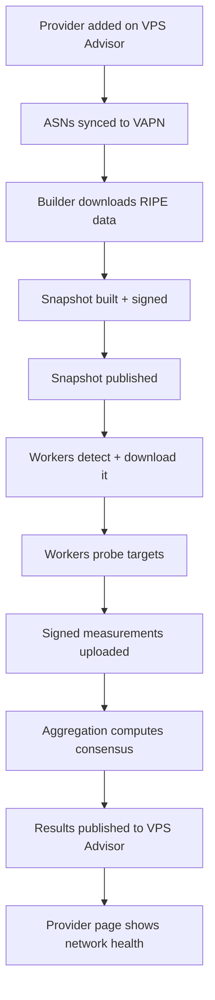

# Walkthroughs

Concepts and architecture tell you *what* the pieces are. Walkthroughs show you
the pieces *in motion* — following real data and control flow through the
system, stage by stage, in plain English. Read these once the
[Core Concepts](../concepts/README.md) make sense; they're the bridge from
theory to the running system.

## Start here

**[End-to-end: a provider becomes a public verdict](end-to-end.md)** — the
master walkthrough. Follow one provider from the moment it's added on VPS
Advisor, through routing, probing, and consensus, to the health badge on its
public page. Every other walkthrough zooms into one stage of this one.

## Focused walkthroughs

| Walkthrough | Zooms into | Audience |
|---|---|---|
| [Worker authentication](worker-authentication.md) | Enrollment, keypairs, request signing, replay protection, rotation | Developers, security reviewers |
| [Measurement lifecycle](measurement-lifecycle.md) | Heartbeat → lease → probe → sign → upload → persist | Developers |
| [Trust calculation](trust-calculation.md) | How a worker's score is computed, window by window, with numbers | Developers, operators |

Three stages of the end-to-end flow are documented where they are *used* rather
than as separate walkthroughs:

| Stage | Where it lives |
|---|---|
| The builder run: RIPE → PostgreSQL → signed artifact → published | [How the builder works](../builder/README.md#one-build-stage-by-stage) |
| From `install.sh` to a probing worker | [Install a worker → what it actually does](../worker/installation.md#what-vapn-install-actually-does) |
| Health-gated worker updates and min-version enforcement | [Operating a worker → updating](../worker/operations.md#updating) |

Each is self-contained but assumes the concepts. If a term is unfamiliar, the
[Glossary](../reference/glossary.md) has it.
