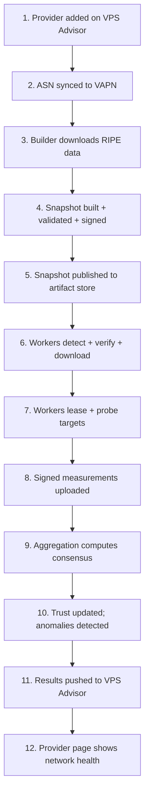

# End-to-End: A Provider Becomes a Public Verdict

This is the master walkthrough. We follow a single provider — call it
**ExampleHost**, owning **AS64500** — from the moment it's added on VPS Advisor
all the way to the network-health badge on its public page. Every stage links to
the concept behind it and the focused walkthrough that goes deeper.

If you read only one document to understand how VAPN works as a *system*, read
this one.



---

## Stage 1 — A provider is added on VPS Advisor

A hosting company claims its listing on **VPS Advisor** (the website — *not*
this project) and an admin records its **ASN(s)**: ExampleHost owns `AS64500`.
Someone toggles **monitoring enabled** for it.

Nothing in VAPN has happened yet. VPS Advisor is the
[source of truth](../README.md#project-background) for *which* providers exist
and *which* ASNs they own; VAPN never discovers providers on its own.

> **Concept:** [ASN & BGP](../concepts/asn-and-bgp.md) — why a provider *is* its
> ASNs on the Internet.

## Stage 2 — The ASN is synced into VAPN

Every couple of minutes, VAPN's **coordinator** pulls the provider catalog from
VPS Advisor's `GET /api/v1/monitoring/providers` endpoint (using its service
credential). It sees ExampleHost, `AS64500`, `monitoring_enabled=true`,
priority. It stores this as a **cache with provenance** — just the ID, name,
ASNs, priority, and enabled flag — never a full copy of provider business data.

At this instant ExampleHost is *known* but not yet *measurable*: there are no
prefixes and no probe targets for it until the next builder run includes it.

> **Deeper:** [Provider sync lifecycle](../architecture/06-lifecycles.md#3-provider-sync-lifecycle)
> · [Integration §4.1](../integration/django-integration.md#41-provider-catalog-platform-pulls).

## Stage 3 — The builder downloads RIPE routing data

On its schedule (three times a day), the **[Routing Builder](../builder/README.md)** runs:

1. It asks VPS Advisor for the current list of monitored ASNs — `AS64500` is now
   on it.
2. It downloads the latest **RIPE RIS `bview`** dump — a full snapshot of the
   global routing table in **MRT** format, ~1M routes (in dev, the pre-
   downloaded `data/ripe/latest-bview.gz`).

> **Concept:** [RIPE, RIS & MRT](../concepts/ripe-and-ris.md) — what this data
> is and why the builder, not workers, reads it.

## Stage 4 — A snapshot is built, validated, and signed

The builder streams through the million MRT records and keeps only the slice it
cares about — prefixes **originated by `AS64500`** (and the other monitored
ASNs). Say ExampleHost announces `203.0.113.0/24` and `198.51.100.0/23`. The
builder then:

- **Deduplicates** (many RIS peers reported the same prefix).
- **Drops bogons** and **flags MOAS conflicts** — never guessing ownership.
- **Enriches** each prefix with **[GeoIP](../concepts/geoip.md)** (country,
  city, coordinates).
- **Loads** the result into the canonical `routing` schema in PostgreSQL under a
  new **snapshot version**.
- **Derives probe targets** — a small, capped set of representative addresses
  per prefix/region (not every one of the 256+512 addresses).
- **Sanity-gates** the build: if the prefix count swung wildly versus the
  previous snapshot, it *holds for admin approval* rather than publishing
  possibly-poisoned data.
- **Exports a signed SQLite artifact** + a manifest (version, counts, sha256,
  Ed25519 signature, minimum worker version).

> **Concept:** [Prefix ownership](../concepts/prefix-ownership.md). **Deeper:**
> [How the builder works](../builder/README.md#one-build-stage-by-stage).

## Stage 5 — The snapshot is published

The builder uploads the artifact + manifest to the **artifact store** (an
S3-compatible bucket, CDN-frontable), verifies the readback, marks the new
snapshot `published`, and marks the previous one `superseded`. Publication is
**atomic from the workers' view**: until this moment they keep using the old
snapshot; the instant it completes, the new version is the current one. If any
step failed, the half-built snapshot is left in `building` (never published) and
the old one stays fully in force.

The coordinator will now advertise the new version to workers in heartbeats.

## Stage 6 — Workers detect, verify, and download it

Each **community worker**, on its ~30-second heartbeat, is told "current
snapshot is version X." If it doesn't have X yet, it:

1. Downloads the artifact from the store (or CDN).
2. **Verifies** the sha256 and the **Ed25519 signature** against a public key
   *pinned into the worker image* — a tampered or substituted artifact is
   rejected. It also checks the version is newer (downgrade protection).
3. **Atomically swaps** it in (download to temp, verify, rename).

The worker now holds ExampleHost's targets locally and can even re-check that a
target is legitimate before probing it. The artifact store itself is untrusted
by design — integrity comes entirely from the signature.

> **Concept:** [Trust — snapshot integrity](../concepts/measurement-and-consensus.md).
> **Deeper:** [Worker authentication](worker-authentication.md).

## Stage 7 — Workers are assigned targets and probe them

The coordinator's embedded **scheduler** turns targets into **assignments** and
leases them to workers with a **redundancy factor** (default 3): each of
ExampleHost's targets is measured by several workers, deliberately spread across
different regions and source networks, and never by a worker on ExampleHost's
own network.

A worker leases some ExampleHost targets and starts probing — an **ICMP echo**
to each target on the assignment's interval, recording reachability and RTT.

> **Concept:** [Why community measurement + redundancy](../concepts/measurement-and-consensus.md#the-fix-community-measurement--redundancy).
> **Deeper:** [Measurement lifecycle](measurement-lifecycle.md).

## Stage 8 — Signed measurements are uploaded

The worker batches its observations (~60 s or a size threshold), **signs each
one and the batch** with its private key, and uploads to
`POST /api/v1/observations`. The coordinator verifies the signature and the
worker's state, checks the timestamp/nonce (replay protection), and persists the
batch to the time-partitioned `measurements` schema via bulk insert. Invalid or
replayed data is rejected at the door and recorded as a trust event.

Crucially: these raw observations are **internal only**. No single one will ever
appear on the public site.

## Stage 9 — Aggregation computes consensus

Every window (default 5 minutes) the **aggregation engine** settles the just-
completed window for ExampleHost:

- Per target, workers vote by **trust weight**; a target is **up** if ≥ 50% of
  weight saw it reachable. Only **responsive targets** (answered someone in 24 h)
  count.
- The provider verdict follows from the up-fraction: **healthy** (≥ 90%),
  **degraded** (≥ 50%), **outage** (< 50%), or **insufficient_data** (fewer
  than 3 distinct workers, or nothing measurable).
- It records confidence, latency p50/p95/p99, and loss rate.

Say 12 trusted workers all reached ExampleHost's targets at ~22 ms: verdict
**healthy**, confidence high.

> **Concept:** [Consensus](../concepts/measurement-and-consensus.md#consensus-from-many-views-to-one-verdict).

## Stage 10 — Trust is updated; anomalies are detected

The same pipeline:

- Scores **per-worker agreement** against the settled consensus and feeds it
  into each worker's **trust** score (agreement is the dominant term). Workers
  that matched the crowd gain; a worker that reported "unreachable" while
  everyone else saw "reachable" loses a little.
- Compares this window to history: a transition into degraded/outage opens a
  **reachability anomaly**; a latency p50 ≥ 2× the 6-hour baseline opens a
  **latency anomaly**; returning to healthy resolves them.

> **Deeper:** [Trust calculation](trust-calculation.md).

## Stage 11 — Results are pushed to VPS Advisor

The engine writes the provider's current status document to a **publication
outbox** and a publisher drains it to VPS Advisor's Results API
(`PUT /api/v1/monitoring/results/providers/{id}`), with **at-least-once,
idempotent** delivery and exponential backoff if the site is down. Anomalies go
to `POST …/results/anomalies`; a fleet-telemetry summary goes to the admin
dashboard endpoint periodically.

```json
PUT …/results/providers/7f9c…
{ "as_of": "2026-07-18T08:05:00Z",
  "global": { "verdict": "healthy", "confidence": 0.97,
    "metrics": { "rtt_p50_ms": 21.4, "loss_rate": 0.001, "worker_count": 12 } } }
```

> **Deeper:** [Integration §4.4](../integration/django-integration.md#44-results-ingestion-platform-pushes).

## Stage 12 — The provider page shows network health

VPS Advisor stores that document and renders the **Network Health** section on
ExampleHost's public page: a healthy badge, confidence, latency, and any recent
instability — with the display guidance that `insufficient_data` is shown as
"not enough data," never as an outage, and that these are *public-network
reachability* signals, not SLA claims.

The loop then repeats forever: new windows refine the verdict, new snapshots
track routing changes, workers come and go, and trust keeps everyone honest.

---

## The whole thing, in one breath

VPS Advisor says *who* to watch → the builder learns each provider's real
public prefixes from RIPE and publishes a signed target list → a global
community of workers probes those targets from many independent vantage points →
every measurement is signed and combined into a trust-weighted consensus → only
that consensus, never any individual's report, is published back to VPS Advisor
for the world to see.

Next, pick any stage to go deeper:
[installation](../worker/installation.md#what-vapn-install-actually-does) ·
[publishing](../builder/README.md#one-build-stage-by-stage) ·
[authentication](worker-authentication.md) ·
[measurement](measurement-lifecycle.md) ·
[trust](trust-calculation.md) ·
[updates](../worker/operations.md#updating).
