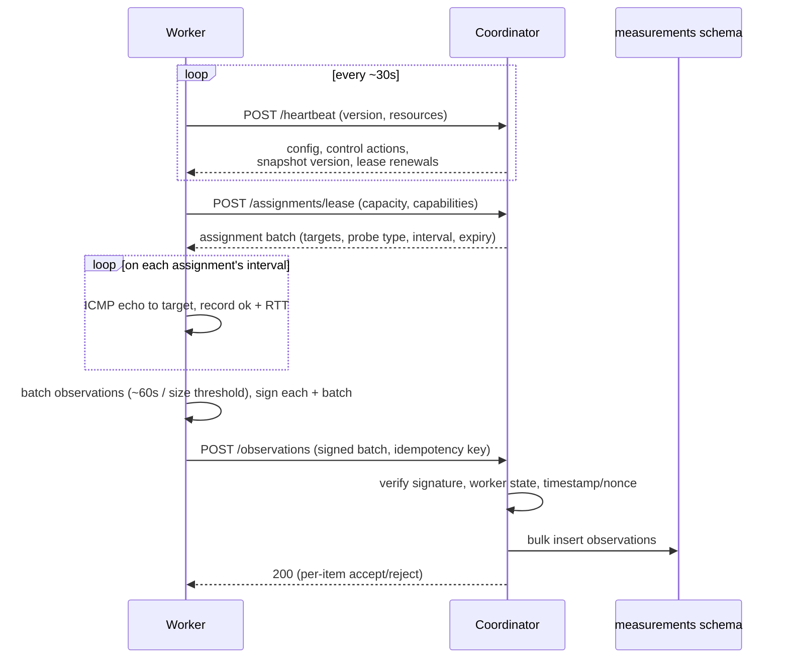

# Walkthrough: Measurement Lifecycle

The steady-state loop of an active worker: how one probe goes from "I have
capacity" to a durable, signed row in the database. This expands
[Stages 7–8](end-to-end.md#stage-7--workers-are-assigned-targets-and-probe-them)
of the end-to-end flow.



## The loop, step by step

1. **Heartbeat (~30 s).** The worker calls `POST /api/v1/workers/heartbeat`
   reporting its version and resource stats. The response carries **config**
   (rate limits, intervals), **control actions** (rotate key, drain, suspend,
   upgrade-required), the **current snapshot version**, and **lease renewals**.
   Heartbeat is the worker's single source of truth about what it should be
   doing. Missing heartbeats → leases expire → the scheduler reassigns the work.

2. **Lease assignments.** The worker calls `POST /api/v1/assignments/lease` with
   its capacity and capabilities. The **scheduler** returns a batch of
   assignments — each an instruction: *probe target T with probe type P every I
   seconds until this lease expires* — respecting `MAX_ASSIGNMENTS_PER_WORKER`
   (default 64) and the redundancy factor (each target covered by N distinct
   workers across regions/networks).

3. **Probe.** For each assignment, on its interval, the worker's **probe
   engine** runs the probe. In v1 that's an **ICMP echo** (a few packets) via
   `internal/probe/icmp`, recording whether a reply came back (`ok`) and the
   round-trip time (`rtt_ms`). Before probing, the worker can re-check the
   target against its local signed snapshot — defense against a stale or tampered
   assignment. The engine is protocol-agnostic (a `Prober` interface), so
   TCP/traceroute/HTTP probes slot in later without changing this loop.

4. **Batch + sign.** Observations accumulate and are flushed roughly every 60 s
   or when a size threshold is hit. Each observation *and* the batch are
   **signed** ([auth walkthrough](worker-authentication.md)). Batching keeps
   upload volume low at fleet scale.

5. **Upload.** `POST /api/v1/observations` with a **batch id** (idempotent — a
   retried batch won't double-insert). The coordinator verifies the request
   signature, the worker's state (`403` if suspended), and timestamp/nonce, then
   validates each observation. It responds `207`-style with per-item
   accept/reject so one bad row doesn't sink the batch.

6. **Persist.** Accepted observations are bulk-inserted (COPY) into the
   time-partitioned `measurements.observation` table (daily partitions,
   internal-only, immutable). This is the platform's write hotspot, which is why
   uploads are batched and inserts are bulk.

7. **Consume.** The [aggregation engine](trust-calculation.md) reads these rows
   each window to compute consensus — but that's a separate pipeline; the worker
   is done once its batch is accepted.

## Resilience built into the loop

- **Coordinator downtime is survivable.** If uploads fail, the worker **queues
  observations locally** (bounded disk buffer) and retries with backoff — brief
  platform maintenance loses no data.
- **Idempotent uploads.** Batch ids mean retries are safe.
- **Lease expiry, not lease loss.** If a worker goes quiet, its leases simply
  expire and the work flows to others; nothing is stuck.
- **Graceful shutdown.** On `SIGTERM` the worker releases its leases
  (`POST /assignments/release`), flushes its upload queue, and exits — so a
  restart or `vapn pause` hands work back cleanly.

## What a stored observation looks like

```
worker_id     assignment_id  target       probe  measured_at            ok   rtt_ms  sig
9f30…         812            203.0.113.7   icmp   2026-07-18T08:04:31Z   t    22.9    …
```

Immutable, signed, internal. It will influence a public verdict only *after*
being combined with many others into [consensus](trust-calculation.md) — never
on its own.

Related: [worker lifecycle](../worker/lifecycle.md) ·
[trust calculation](trust-calculation.md) ·
[API reference — Coordinator](../api/README.md#b-coordinator-api).
