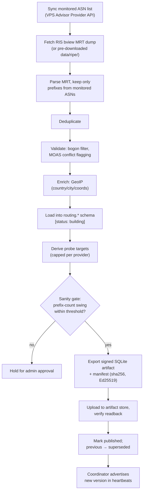

# Walkthrough: Snapshot Publishing

A single **builder** run, start to finish — how raw RIPE routing data becomes a
signed target list workers can trust. This expands
[Stages 3–5](end-to-end.md#stage-3--the-builder-downloads-ripe-routing-data) of
the end-to-end flow. Conceptual background:
[RIPE/RIS/MRT](../concepts/ripe-and-ris.md) and
[prefix ownership](../concepts/prefix-ownership.md). To run the builder, see the
[builder guide](../builder/README.md).

## The run, stage by stage

1. **Sync monitored ASNs.** The builder calls VPS Advisor for the current ASN
   list. Only these ASNs' prefixes will survive the filter — VAPN never builds a
   database of the whole Internet.

2. **Fetch the RIS dump.** A full-table `bview` MRT dump from RIPE RIS (`rrc00`
   by default). It checks the dump's age against `VAPN_RIS_BVIEW_MAX_AGE`; in
   development it uses the pre-downloaded `data/ripe/latest-bview.gz`.

3. **Parse + filter.** It streams ~1M MRT records (via
   `internal/routing/mrtreader`) and keeps only those whose **origin AS** is
   monitored. This is the big reduction: a million routes down to a few thousand.

4. **Deduplicate.** Collapse the many per-peer reports of each
   `(prefix, origin AS)` into single facts.

5. **Validate.** Drop **bogons** (private/reserved/absurd) via
   `internal/routing/bogon`; **flag MOAS conflicts** instead of resolving them.

6. **Enrich with GeoIP.** Look up each prefix in GeoLite2-City for
   country/city/coordinates (from the builder's local copy, refreshed on its own
   cadence with the deployer's MaxMind key).

7. **Load into PostgreSQL** under a new `routing.snapshot` row, status
   `building`. Prefixes are per-snapshot and immutable — diffing snapshots later
   yields routing-churn signals.

8. **Derive probe targets.** Choose representative addresses per prefix/region,
   each with a recorded rationale, capped at `MAX_TARGETS_PER_PROVIDER`
   (default 100).

9. **Sanity gate.** If the prefix count changed by more than
   `VAPN_SANITY_MAX_DELTA_PCT` (default 50%) versus the last snapshot, **hold**
   for admin approval — a wild swing may mean a route leak poisoned the data.
   `VAPN_SANITY_FORCE=true` overrides (use carefully). See
   [risk R-routing](../architecture/08-risk-assessment.md).

10. **Export + sign.** Write the worker-facing subset to a compact **SQLite**
    artifact (`prefixes`, `targets`, `meta`) and a manifest with counts, sha256,
    and an **Ed25519 signature** over the manifest, plus `min_worker_version`.

11. **Publish atomically.** Upload artifact + manifest to the store, verify the
    readback, mark the snapshot `published`, previous → `superseded`. If *any*
    step failed, mark it `failed` and leave the previous published version fully
    in force — workers never see a half-built snapshot.

12. **Advertise.** The coordinator picks up the new `published` version and
    advertises it in heartbeats; workers download and verify it
    ([auth walkthrough](worker-authentication.md)); the scheduler drains
    assignments on removed targets and issues new ones.

## Why it's designed this way

- **One place parses MRT.** Expensive, security-sensitive parsing happens once,
  centrally, auditable — never on thousands of workers.
- **Atomic publish + failed-stays-safe.** Workers always run on a complete,
  verified snapshot; a broken build is a no-op, not an outage.
- **Signed artifacts over an untrusted store.** The artifact store needs no
  trust; the signature is the integrity guarantee, so it can sit behind any CDN.
- **Sanity gate + rollback.** Bad routing data (leaks, hijacks) can't silently
  redirect the fleet; a human is in the loop for anomalous builds, and
  `vapnctl snapshots rollback <version>` re-points to a known-good snapshot.

## Cadence

Routing snapshots build **daily** (RIS `bview` is 8-hourly, but daily is plenty
for prefix membership, and churn comes from diffs). GeoIP refresh is an
**independent weekly** job — a GeoIP update never triggers a routing rebuild and
vice versa. Full detail:
[snapshot lifecycle](../architecture/06-lifecycles.md#2-snapshot-lifecycle).
