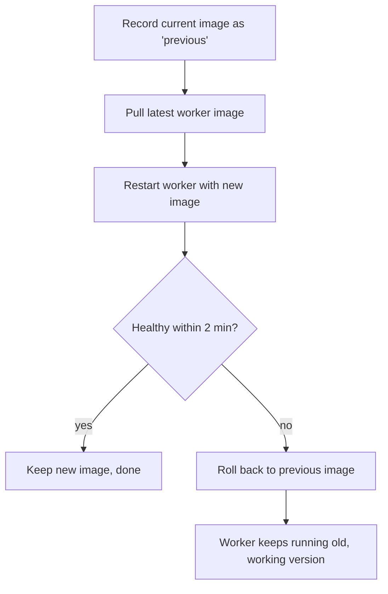
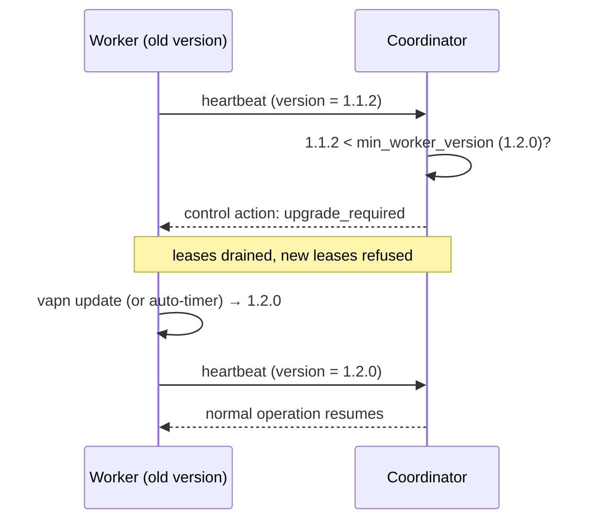

# Walkthrough: Software Updates

How a worker updates safely, and how the platform retires old worker versions
without cutting anyone off. Operator-facing how-to:
[Getting Started → Updating](../getting-started/updating.md).

## Worker self-update: health-gated with auto-rollback

`vapn update` (manual) and `vapn update --auto` (the systemd timer) run the same
safe procedure:

Steps:

1. **Remember the current image** so rollback is possible.
2. **Pull** the latest tag.
3. **Restart** the worker container on the new image.
4. **Health-gate**: wait up to two minutes for the worker to report healthy
   (via its heartbeat/health check).
5. **Decide**: healthy → keep it; not healthy → **automatically roll back** to
   the previous image.

The guarantee: **you cannot break a working worker by updating it.** A bad
release simply rolls back and the worker keeps contributing on the last good
version, while its logs capture why the new one failed.

The auto-update timer runs daily at a **randomized hour** so the whole fleet
doesn't restart in lockstep (which would briefly dent coverage and hammer the
registry). See [`deploy/worker/vapn-update.timer`](../../deploy/worker/vapn-update.timer).

## Platform-side: minimum version enforcement

The platform can require a **minimum worker version** and drain anything older —
the lever for sunsetting buggy or insecure releases fleet-wide.

- Every **heartbeat reports the worker's version**.
- If it's below the minimum, the coordinator responds `upgrade_required`: the
  worker is **drained** (its assignments move to current workers) and **refused
  new leases** until it upgrades. It's not banned — it just can't contribute
  until current. This shows up in `vapn status` and `vapn logs`.
- The minimum is also baked into each **snapshot manifest**
  (`min_worker_version`) so a worker too old to parse a new artifact won't try.

The two mechanisms compose: the platform *asks* old workers to upgrade
(min-version drain), and the worker *can* upgrade safely and unattended
(health-gated auto-update). Together they let the fleet move forward without an
operator having to babysit anything and without a bad release taking workers
down.

## Updating the platform's own services

Worker updates are one thing; upgrading the coordinator/aggregator/builder is an
operator task with its own rules — backward-compatible migrations
(expand→migrate→contract), rolling deploys, and workers tolerating brief
coordinator downtime by queueing observations locally. That's covered in
[Operations → Upgrades](../operations/upgrades.md) and
[release management](../operations/release-management.md).
