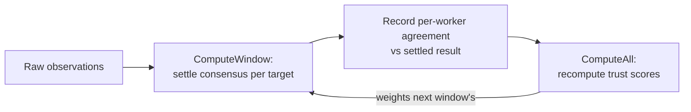

# Walkthrough: Trust Calculation

How a worker's **trust score** is computed, window by window, with the actual
formula and worked numbers. This expands
[Stages 9–10](end-to-end.md#stage-9--aggregation-computes-consensus) of the
end-to-end flow and makes concrete the
[trust concept](../concepts/measurement-and-consensus.md#trust). Implementation:
`internal/trust` (scoring) and `internal/aggregate` (agreement + consensus).

## The two pipelines involved

Trust emerges from two cooperating pipelines that run each window (default
5 min):

1. **Consensus** (`aggregate.ComputeWindow`) settles what actually happened —
   per target, whether it was "up" by trust-weighted vote — and records how well
   **each worker agreed** with that settled result into
   `aggregation.worker_agreement`.
2. **Scoring** (`trust.ComputeAll`) recomputes every worker's overall trust from
   its recent agreement plus availability, tenure, and penalties.



That feedback loop is the whole idea: consensus judges workers; the resulting
trust weights the next consensus.

## Step 1 — agreement against the settled window

For each target in the window, consensus computes whether it was **up**
(≥ 50% of trust weight saw it reachable). Then, for each worker, it measures how
close that worker's own ok-ratio was to the settled truth:

```
agreement_for_target = 1 − |worker_ok_ratio − settled_up(0 or 1)|
```

A worker averages this across all targets it measured, and the result is stored
per window. Examples for one target that settled **up**:

| Worker saw | ok_ratio | Settled | Agreement |
|---|---|---|---|
| reachable every time | 1.0 | 1 (up) | **1.00** |
| reachable 3 of 4 | 0.75 | 1 (up) | 0.75 |
| unreachable every time | 0.0 | 1 (up) | **0.00** |

Crucially this is scored against the **settled** window, not the instantaneous
majority — a worker that correctly detected an outage a little early still
matches the final settled result and is *not* penalized for being ahead of the
crowd.

## Step 2 — the four components

`trust.ComputeAll` recomputes every non-retired worker's score from four
components (all in [0,1] except penalty which subtracts):

| Component | How it's computed | Intuition |
|---|---|---|
| **agreement** | mean `worker_agreement` over the last 24 h of settled windows; **0.5** (neutral) if the worker has no history yet | did you match reality? |
| **availability** | heartbeat recency: **1.0** if seen < 5 min ago, **0.5** if < 1 h, else **0.0** | are you actually online? |
| **tenure** | `d / (d + 14)` where `d` = days since approval | how long have you been around? |
| **penalty** | `0.1 ×` count of `bad_signature`/`replay` events in the last 7 days, capped at **0.5** | are you misbehaving? |

## Step 3 — the formula

```
score = clamp( availability × (0.2 + 0.3 × tenure) + 0.5 × agreement − penalty , 0, 1 )
```

Read it as: agreement is the dominant term (weight 0.5); availability gates a
tenure-scaled base (a worker that isn't online contributes nothing from that
term); penalties bite directly.

### Worked examples

**A brand-new, honest, online worker** (approved today, no history, no
penalties):

```
availability = 1.0
tenure       = 0 / (0 + 14)            = 0.0
agreement    = 0.5   (neutral default)
penalty      = 0.0
score = 1.0 × (0.2 + 0.3×0.0) + 0.5×0.5 − 0 = 0.20 + 0.25 = 0.45
```

It starts mid-range but low-ish — enough to contribute a little (consensus gives
every worker a weight floor of 0.1), not enough to dominate.

**A seasoned, reliable worker** (approved 60 days ago, always agrees, always
online):

```
availability = 1.0
tenure       = 60 / (60 + 14)          ≈ 0.81
agreement    = ~1.0
penalty      = 0.0
score = 1.0 × (0.2 + 0.3×0.81) + 0.5×1.0 = 0.443 + 0.5 = 0.94
```

Near the top — this worker's vote carries real weight.

**A worker with a wrong clock** (submitting replays/bad signatures):

```
availability = 1.0
tenure       = 0.81
agreement    = 0.9
penalty      = min(0.5, 0.1 × 6 events) = 0.5
score = 0.443 + 0.45 − 0.5 = 0.39
```

The penalty drags an otherwise-good worker down and, if it persists, triggers
quarantine.

## Step 4 — how trust is *used*

- **Weight in consensus** = the worker's score, floored at 0.1 for `active`
  workers so newcomers count a little; **0 for any non-`active` state**.
- **Per-operator cap** limits how much total weight one operator's workers can
  contribute — blunting Sybil attacks even further.
- **Quarantine (shadow mode)**: a worker whose trust collapses keeps measuring
  at weight 0 and rebuilds agreement over subsequent windows — it can earn its
  way back without an admin, though only an admin can `retire` or `reinstate`.

## Why these choices

| Choice | Defends against |
|---|---|
| Agreement scored vs *settled* window | Punishing correct-but-early workers |
| Tenure ramp (`d/(d+14)`) | Sybil attacks — fresh workers can't buy influence |
| Neutral 0.5 for no-history workers | Neither trusting nor distrusting the unknown |
| Penalty decays over 7 days | One bad day shouldn't be permanent; sustained abuse is |
| Zero weight unless `active` | Suspended/pending/retired workers can't sway results |
| Per-operator weight cap | One actor running many honest-looking nodes |

The design record is [Security & trust model §4](../architecture/05-security-trust-model.md#4-trust-model);
the concept is [trust](../concepts/measurement-and-consensus.md#trust).
