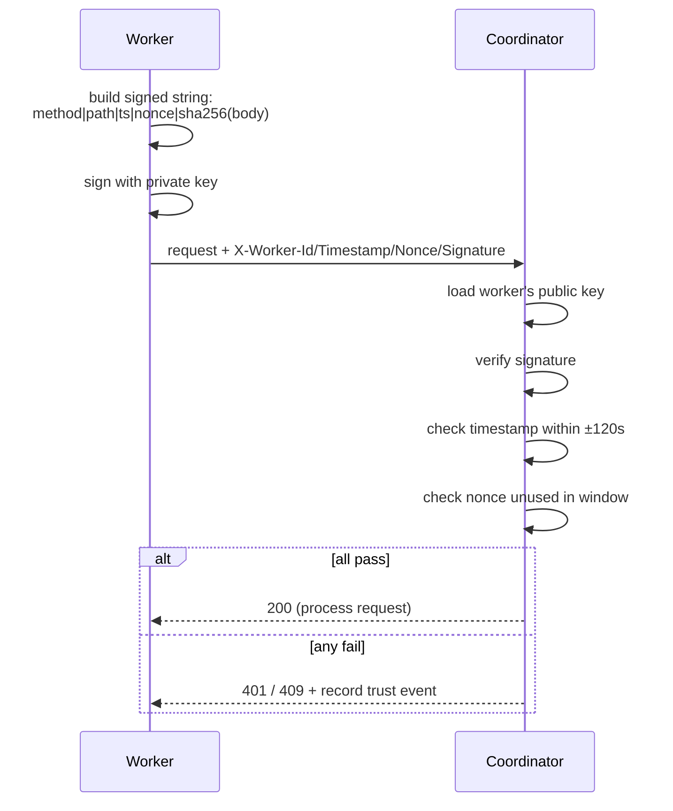

# Walkthrough: Worker Authentication

How VAPN knows a request really came from a specific worker, hasn't been
altered, and isn't a replay — using **Ed25519 request signing**. This is the
security backbone of the worker↔coordinator channel. Design reference:
[Security & trust model](../architecture/05-security-trust-model.md); the code
is `internal/wireauth`.

## Why signing, on top of HTTPS?

HTTPS encrypts the channel and authenticates the *server* to the worker. It does
**not**, on its own, prove which *worker* sent a request or stop a captured
request from being replayed. VAPN assumes workers can be malicious or
compromised, so every request carries a per-worker **signature** in addition to
running over HTTPS. Two independent guarantees:

- **HTTPS**: nobody on the wire can read or tamper in transit.
- **Ed25519 signature**: the coordinator can prove *this exact request* was
  produced by the holder of *this worker's* private key, and that the body
  wasn't changed.

## The keypair

At first boot the worker generates an **Ed25519 keypair** (a modern, fast,
32-byte public-key signature scheme). The **private key never leaves** the
worker's volume. The **public key** is registered with the coordinator during
[enrollment](worker-installation.md). From then on the worker signs; the
coordinator verifies with the stored public key.

## Every request is signed

Every worker request except `register` carries these headers:

```
X-Worker-Id: <uuid>
X-Timestamp: <RFC3339, must be within ±120s of server clock>
X-Nonce:     <128-bit random, unique per request>
X-Signature: Ed25519( method | path | timestamp | nonce | sha256(body) )
```

The coordinator verifies by:

1. Looking up the worker's currently-valid public key.
2. Recomputing the signed string from the request and checking the signature.
3. Checking the **timestamp** is within the ±120 s window (clock-skew tolerant,
   replay-hostile).
4. Checking the **nonce** hasn't been seen for this worker within the window
   (`registry.replay_nonce`, TTL-pruned).

Any failure → the request is rejected (`401` bad signature/expired,
`409` replayed nonce) **and** a `bad_signature` or `replay` **trust event** is
recorded, which lowers the worker's [trust](trust-calculation.md).



## Why timestamp *and* nonce?

They defend different replays:

- **Timestamp** bounds how long any captured request is usable — outside ±120 s
  it's dead. It also stops an attacker from replaying *old healthy* observations
  during an outage, because observations bind `measured_at`.
- **Nonce** stops replay *within* the window — the same request can't be
  submitted twice even a second apart.

Together they give tight replay protection without requiring perfectly
synchronized clocks (hence the worker's clock check at install time).

## Observations are individually signed too

Beyond the request signature, **each observation inside a batch is also signed**.
So even if a measurement were ever relayed through some future ingestion path,
its per-measurement provenance survives — you can always prove which worker
produced which data point. This is why raw observations remain attributable
forever in the audit trail.

## Key rotation

Keys can be rotated without downtime:

1. The worker submits its **next** public key, signed by its **current** key
   (`POST /api/v1/workers/keys/rotate`).
2. Both keys are valid during a bounded **overlap window** (`registry.worker_key`
   allows one current + overlapping keys), so in-flight requests don't fail.
3. After the overlap, only the new key is valid.

Rotation happens on a routine schedule and can be **demanded by the server** —
a heartbeat control action forces rotation on suspected compromise
(`vapnctl workers rotate-key <id>`). **Revocation** is the sharp lever: revoking
all of a worker's keys cuts it off instantly, paired with a state transition to
`suspended` or `quarantined`.

## What this buys the system

| Guarantee | Mechanism |
|---|---|
| Only the real worker can act as itself | Private key never leaves the worker; signature verified against registered public key |
| Requests can't be tampered in flight | Signature covers method, path, and body hash |
| Captured requests can't be replayed | Timestamp window + per-worker nonce uniqueness |
| Compromise is recoverable | Rotation (overlap) + instant revocation + state transition |
| Attacks are visible and penalized | Failures recorded as trust events, surfaced in audit + telemetry |

Related: [enrollment](worker-installation.md) ·
[trust calculation](trust-calculation.md) ·
[Security & trust model](../architecture/05-security-trust-model.md).
