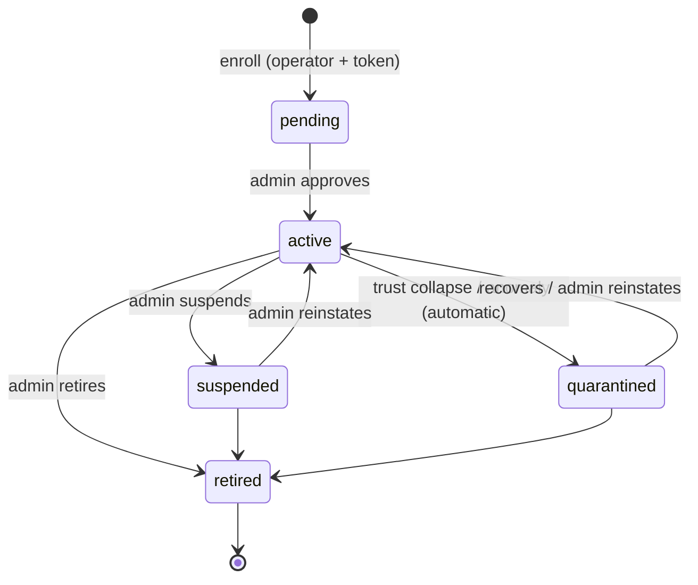

# Worker Lifecycle

Every state a worker moves through, what it can and can't do in each, and who
controls the transitions. Understanding this makes `vapn status`, approval
delays, and quarantine make sense. The design record is
[architecture 06 §1](../architecture/06-lifecycles.md#1-worker-lifecycle); the
concept is [trust & reputation](../concepts/measurement-and-consensus.md#reputation-and-the-worker-lifecycle).

## The states at a glance

| State | Can authenticate? | Gets assignments? | Weight in consensus |
|---|---|---|---|
| **pending** | register + heartbeat only | none | 0 |
| **active** | full | yes | trust-based |
| **suspended** | rejected (403) | none (leases revoked) | 0 |
| **quarantined** | full | yes (shadow) | 0 — results recorded to rebuild trust |
| **retired** | rejected, keys revoked | none | 0, forever |

## pending

Where every worker starts, right after [enrollment](installation.md#what-vapn-install-actually-does).
It can heartbeat (so the platform knows it's alive) but receives no work and
counts for nothing until a **human admin approves it**. This manual gate is a
deliberate anti-abuse step — it's the main thing stopping someone from flooding
the network with fake workers.

*What you see:* `vapn status` shows "Awaiting approval." *What to do:* nothing —
check your VPS Advisor dashboard for the approval decision.

## active

The normal, healthy state. The worker leases assignments, probes, uploads signed
measurements, and its measurements count in [consensus](../concepts/measurement-and-consensus.md#consensus-from-many-views-to-one-verdict)
weighted by its [trust](../concepts/measurement-and-consensus.md#trust). Trust rises as it agrees with the
crowd and stays online; it can fall on misbehavior.

*What you see:* assignments held, measurements climbing, healthy heartbeats.

## quarantined (shadow mode)

Entered **automatically** when a worker's trust collapses or it triggers
anomalies (a wrong clock, tampered binary, or consistent disagreement with
consensus). A quarantined worker keeps measuring — but at **weight 0**, so its
results can't affect public verdicts. Those results are still recorded and
scored for agreement, so the worker can **earn its way back** to `active` as its
agreement recovers over subsequent windows.

*What you see:* `vapn status`/`vapn logs` explain why (usually a clock or
version issue). *What to do:* fix the underlying cause; trust recovers on its
own. Only an admin can force reinstatement early.

## suspended

An **admin action** (not automatic): the worker is locked out entirely — its
requests are rejected (`403`) and its leases revoked. Used when a worker or
operator needs to be stopped immediately. Reversible: an admin can reinstate it
to `active`.

## retired

Terminal. An **admin** (or the operator via `vapn unregister`) retires the
worker: keys revoked, no further work, history kept for audit. There's no path
back — a retired worker's operator installs a *new* worker (new identity,
trust from scratch) if they return.

## Who controls transitions

The governing rule: **administrators outrank automation.**

| Transition | Trigger |
|---|---|
| pending → active | admin approval (human) |
| active → quarantined | automatic (trust collapse / anomaly) |
| quarantined → active | automatic recovery **or** admin reinstate |
| active/quarantined → suspended | admin |
| suspended → active | admin |
| any → retired | admin, or operator's `vapn unregister` |

Automation may *quarantine* (a reversible, zero-weight holding state) but never
*retires* or *reinstates* on its own — those decisions are always a human's.

## The `unreachable` attribute (not a state)

Separately from these states, a worker that stops heartbeating is flagged
**`unreachable`** on the admin dashboard. This is an *attribute*, not a lifecycle
state — an `active` worker that goes silent is still `active`, just unreachable,
and resumes normally when it comes back. Its leases expire and the work flows to
others in the meantime.

## Operator controls vs platform states

Your `vapn` commands map onto this lifecycle:

| You run | Effect on lifecycle |
|---|---|
| `vapn install` | Creates a worker in `pending` |
| `vapn pause` / `resume` | No state change — just stops/starts probing locally (keeps `active` + trust) |
| `vapn unregister` | Moves the worker to `retired` |
| `vapn uninstall` | Offers `unregister` (→ `retired`), then removes everything locally |

Note that **pausing is not suspension**: pause is your local choice and
preserves everything; suspension is an admin lockout. Choose `pause` for
temporary breaks.

Related: [operating a worker](operations.md) ·
[trust calculation](../walkthroughs/trust-calculation.md) ·
[security & trust model](../architecture/05-security-trust-model.md).
