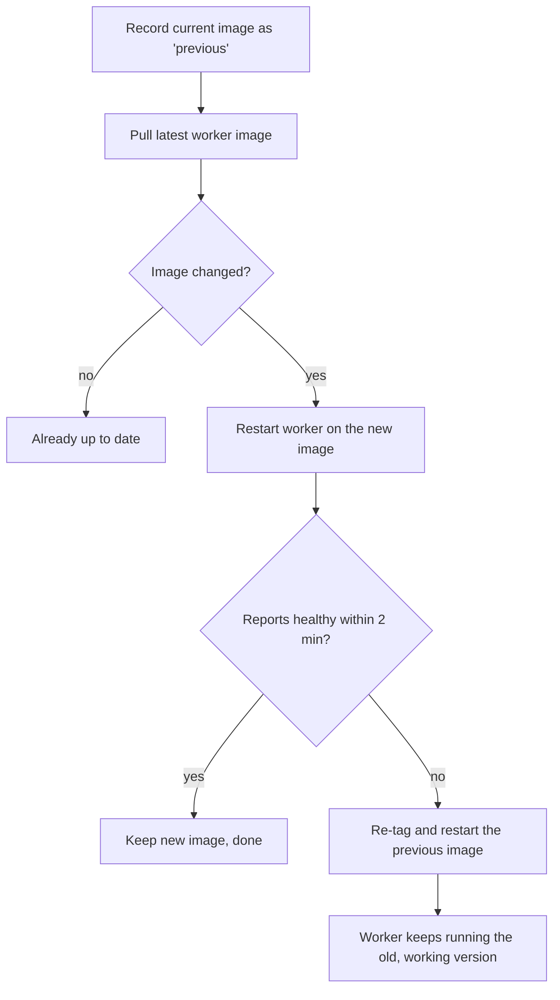
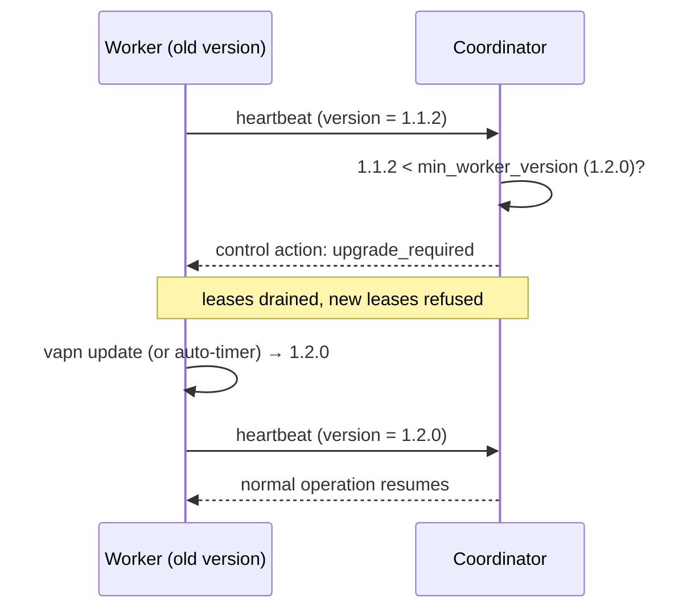

# Operating a Worker

Everything you do to a running worker: the full `vapn` command set, keeping it
updated, pausing, backing it up, and leaving cleanly.

`vapn` is the small CLI the installer places on your host. It wraps Docker so
you never have to think about containers directly. Run `vapn` with no arguments
to print the command list. The worker's home directory is `~/.vapn` (override
with `VAPN_HOME`).

## Quick index

| Command | One-liner |
|---|---|
| [`install`](#install) | Set up and start a worker (interactive) |
| [`reconfigure`](#reconfigure) | Change settings, keep the worker's identity |
| [`status`](#status) | Worker health at a glance |
| [`doctor`](#doctor) | Run the system checks |
| [`logs`](#logs) | Show worker logs (`-f` to follow) |
| [`pause`](#pause) | Stop probing, keep identity |
| [`resume`](#resume) | Start probing again |
| [`update`](#update) | Update the worker image (health-gated, auto-rollback) |
| [`backup`](#backup) | Archive identity + config |
| [`unregister`](#unregister) | Permanently retire this worker with the network |
| [`uninstall`](#uninstall) | Remove everything |
| [`version`](#version) | Print the CLI version |

---

## The commands

### `install`

```sh
vapn install
```

Interactive setup: runs the [system checks](#doctor), prompts for the
**coordinator URL**, **worker name**, **snapshot public key** and **enrollment
token**, writes `~/.vapn/config.env`, generates the compose file, starts the
container, and waits for it to report in. Idempotent — safe to re-run. Usually
invoked for you by `install.sh`. → [Installation](installation.md).

### `reconfigure`

```sh
vapn reconfigure
```

Change a setting on a worker that is already running — most often the
coordinator URL (the platform moved, or its port changed) or the snapshot
public key (the operator rotated it).

It asks the same questions as `install`, showing what is configured now as the
default: **press Enter to keep a value**. Secrets are displayed masked
(`TbP5t********la/rw=`), so you can see *which* value is stored without it being
printed, and you never have to re-enter one to change something else. Then it
re-runs the system checks, rewrites the config and compose file, recreates the
container and waits for the worker to report healthy.

```
Reconfiguring the worker in /home/you/.vapn
Worker identity: 9f30… (preserved — not re-enrolled)
Press Enter to keep a value as it is.

Coordinator URL [https://probes.vpsadvisor.com]:
Worker name [helsinki-1]:
Snapshot public key [TbP5t********la/rw=] (Enter keeps it):
```

- **Your identity is safe.** The private key, worker ID and trust history are
  never touched, and a worker that has already registered is not asked for an
  enrollment token again — that token is one-time, and re-enrolling would make
  this a brand-new worker with no trust history.
- **Nothing is written if the checks fail**, so a mistake leaves the running
  worker untouched.
- **Safe to run as often as you like.** Nothing is duplicated, no credentials
  are regenerated, and settings you added to `config.env` by hand are kept.

There is no `reinstall`: this command covers configuration and container
recreation, [`update`](#update) covers the image, and
[`uninstall`](#uninstall) covers removal.

### `status`

```sh
vapn status
```

Worker health at a glance:

```
Worker:                 Healthy
Worker ID:              9f30…
Software:               v1.2.0
Coordinator:            https://probes.vpsadvisor.com
Routing snapshot:       20260808T0800Z-1723118400000
Last heartbeat:         12s ago
Assignments:            18
Measurements submitted: 4210
Last upload:            43s ago (86 ms)
```

`Worker` reads `Healthy` when active, `Awaiting approval` while pending, or
`Unreachable (last report … ago)` if the container hasn't reported for over two
minutes. → interpreting the states: [lifecycle](lifecycle.md).

### `doctor`

```sh
vapn doctor
```

Re-runs the eight environment checks: Docker CLI, Docker daemon, Docker
Compose, ≥2 GB free disk, a writable state directory, a well-formed snapshot
public key, the coordinator reachable, and clock skew under 90 seconds. Each
failure prints a specific reason. Run it whenever something looks off. →
[Troubleshooting](troubleshooting.md).

### `logs`

```sh
vapn logs          # recent logs
vapn logs -f       # follow live
```

Streams the worker container's logs. Safe to share when reporting a problem —
**the private key never appears in logs**. Look here for the last error line
when diagnosing.

### `pause`

```sh
vapn pause
```

Stops probing but **keeps your identity and accumulated trust**. Your
assignments redistribute to other workers within about a minute. Use it for
maintenance windows or when you need your bandwidth.

Prefer this over uninstalling if you'll be back: resuming keeps your trust,
while reinstalling creates a *new* identity that starts trust-building from
scratch.

### `resume`

```sh
vapn resume
```

Resumes probing after a `pause`. The worker re-leases assignments on its next
cycle.

### `update`

```sh
vapn update           # manual, health-gated update
vapn update --auto    # what the systemd timer runs (unattended)
```

Pulls the latest worker image, restarts, and waits for health. **If the new
version isn't healthy within two minutes, it automatically rolls back** to the
previous image. See [Updating](#updating) below for the full mechanics.

### `backup`

```sh
vapn backup
```

Archives `~/.vapn` — identity and configuration — to a timestamped `tar.gz` in
the current directory.

> ⚠️ **The archive contains your private key.** Treat it like a password.

Use it to move a worker to another host, or to restore the same identity (and
its accumulated trust) instead of enrolling fresh. To restore: copy the archive
to the new machine and unpack it so the contents land in `~/.vapn`.

### `unregister`

```sh
vapn unregister
```

Tells the coordinator this worker is retiring: it is marked `retired`, its keys
are revoked, and it receives no further work — history is retained for audit.
Asks you to type `retire` to confirm, then stops the container.

This is the polite, immediate way to leave. `uninstall` offers to do it for you.

### `uninstall`

```sh
vapn uninstall
```

Removes everything — see [Leaving](#leaving) below.

### `version`

```sh
vapn version
```

Prints the `vapn` CLI version. To see the running *worker image* version, use
[`status`](#status).

---

## Updating

Workers are versioned container images. Keeping current matters: the platform
can require a minimum worker version (older workers are drained until they
upgrade), and updates carry fixes and new probe types.

Updating is **safe by design** — health-gated with automatic rollback.

### Update on demand

```sh
vapn update
```



1. **Remember the current image** so rollback is possible.
2. **Pull** the latest tag. If the registry is unreachable, the update is
   abandoned and your working image is kept.
3. **Restart** the worker on the new image — skipped entirely if the pull
   produced no change.
4. **Health-gate:** wait up to two minutes for the worker to write a fresh
   status report in a usable state.
5. **Decide:** healthy → keep it; not healthy → **automatically roll back** to
   the previous image.

The guarantee: **you cannot break a working worker by updating it.** A bad
release rolls back and the worker keeps contributing on the last good version,
while its logs capture why the new one failed.

### Automatic updates (recommended)

Install the systemd units shipped in the repository:

```sh
git clone https://github.com/HummingByteDev/vpsa-network-discovery.git
sudo cp vpsa-network-discovery/deploy/worker/vapn-update.* /etc/systemd/system/
sudo sed -i "s/^User=.*/User=$USER/" /etc/systemd/system/vapn-update.service
sudo systemctl daemon-reload
sudo systemctl enable --now vapn-update.timer
```

> The `sed` line is important: the shipped unit has `User=vapn`, and it must
> run as the account that ran `vapn install`, because the worker's state lives
> in that user's home directory.

Verify:

```sh
systemctl list-timers vapn-update.timer
```

**Healthy result:** the timer is listed with a `NEXT` time in the future. It
runs `vapn update --auto` daily at a **randomized hour** (up to 6 h of jitter),
so the whole fleet doesn't restart in lockstep.

> **Prefer to control the timing yourself?** Skip the timer and run
> `vapn update` from your own cron or configuration-management tooling. The
> command is idempotent and safe to run when already up to date.

### How the platform signals "please upgrade"



Every heartbeat reports your worker's version. If it is below the platform's
**minimum supported version**, the coordinator responds with an
`upgrade_required` control action: the worker is *drained* (its assignments move
to other workers) and refused new leases until it upgrades. It is not banned —
it just can't contribute until current. You'll see it in `vapn logs`.

The same floor is baked into each snapshot manifest (`min_worker_version`), so
a worker too old to read a new artifact won't try.

The two mechanisms compose: the platform *asks* old workers to upgrade, and the
worker *can* upgrade safely and unattended. The fleet moves forward without
anyone babysitting it and without a bad release taking workers down.

### Verifying an update

```sh
vapn version    # CLI version
vapn status     # running worker version + health
vapn logs -f    # watch it come back up
```

### Updating the CLI itself

`vapn update` updates the *worker image*. To update the `vapn` binary, re-run
the installer (it overwrites the binary in place), or `git pull && make build`
if you installed from source.

---

## Leaving

You can leave the network at any time, and leaving is clean — no orphaned
containers, images, or files. There is no lock-in and no penalty.

### The one command

```sh
vapn uninstall
```

It asks two questions, then removes everything:

1. **Also unregister the worker with the coordinator?** *(recommended)* This
   tells the coordinator your worker is retiring so it stops assigning you work
   and marks the worker `retired` (keys revoked, history retained for audit).
   Declining just stops the local container; the platform notices the silence
   and flags the worker unreachable on its own, but unregistering is the polite,
   immediate way out.
2. **Keep a backup of the configuration and identity?** Runs
   [`vapn backup`](#backup) first, in case you want to come back. If the backup
   fails, the uninstall aborts rather than destroying an unsaved identity.

Then it removes the containers, the worker image, and the entire `~/.vapn`
directory. The `vapn` binary itself stays — remove it with
`sudo rm "$(which vapn)"`.

### Just pausing, not leaving

If you only want to stop probing for a while, don't uninstall:

```sh
vapn pause     # stops probing; keeps your identity and trust
vapn resume    # back to work
```

While paused, your assignments redistribute to other workers within a minute
and your accumulated [trust](../concepts/measurement-and-consensus.md#trust) is
preserved. Uninstalling and re-installing creates a *new* worker identity that
starts trust-building from scratch.

### Manual cleanup (if `vapn` is already gone)

If you deleted the CLI before uninstalling, remove the pieces by hand:

```sh
docker compose -f ~/.vapn/docker-compose.yml down --rmi all
rm -rf ~/.vapn
sudo rm -f /usr/local/bin/vapn
```

Your worker will then go silent and the platform will flag it unreachable; an
admin can retire it. To retire it immediately and cleanly, prefer
`vapn unregister` *before* manual cleanup.

---

## Common recipes

```sh
# First install, then confirm it's healthy
vapn install && vapn status

# Something's wrong — diagnose
vapn doctor ; vapn logs -f

# Going away for a bit (keep identity/trust)
vapn pause          # …later… vapn resume

# Move this worker to a new machine
vapn backup         # copy the tar.gz over, unpack into ~/.vapn there

# Leave for good, cleanly
vapn uninstall      # accept the unregister prompt
```

Related: [lifecycle](lifecycle.md) ·
[resource usage & privacy](resources-and-privacy.md) ·
[troubleshooting](troubleshooting.md).

Thanks for the packets.
